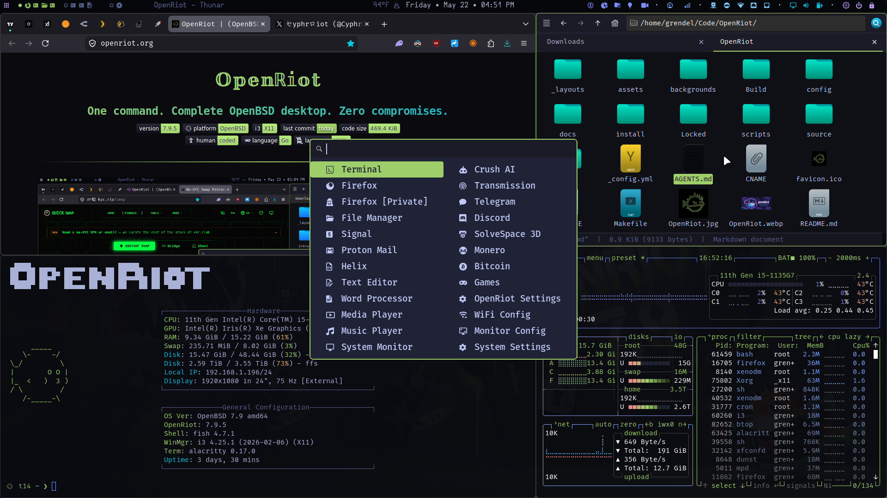
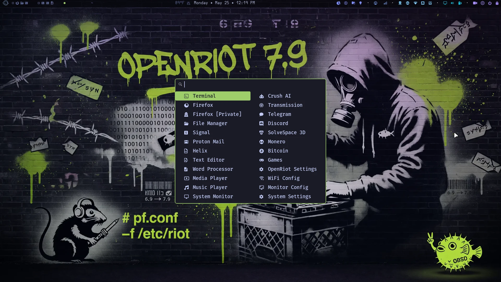
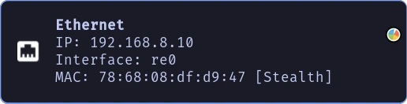
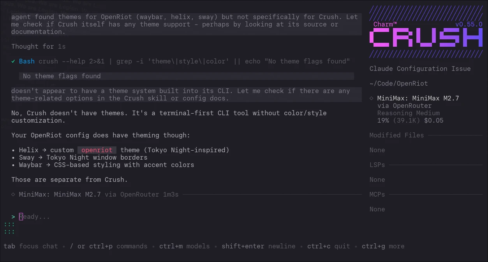
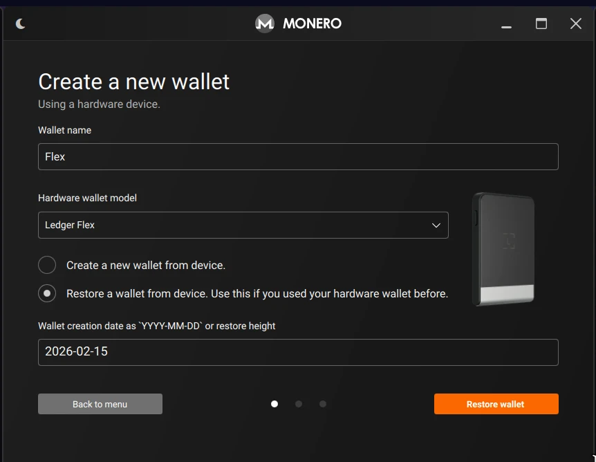
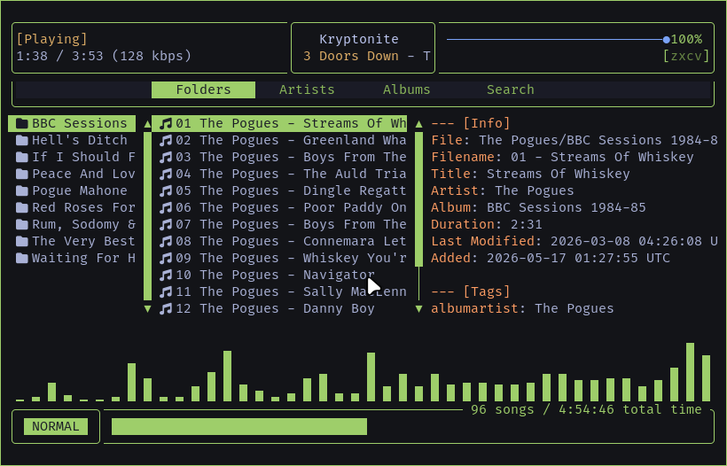

<div align="center">

# 𝕆𝕡𝕖𝕟ℝ𝕚𝕠𝕥

## One command. Complete OpenBSD desktop. Zero compromises.


</div>

---



---


## 𝕆𝕡𝕖𝕟ℝ𝕚𝕠𝕥

OpenRiot is a clean, minimal, ridiculously polished i3-based OpenBSD 7.9 setup with fish, Helix, and Polybar — all tuned so things just work. No more config drama, no more obscure package fights, no more “works on Linux” copium.

Install base OpenBSD 7.9 → run one script → get a fast, dark, beautiful desktop that respects OpenBSD’s strengths instead of fighting them and adds all the workflow you need to be productive as a user and a developer.

OpenRiot versions track OpenBSD releases directly. OpenBSD 7.9
= OpenRiot 7.9.x. The patch digit is for OpenRiot-specific fixes
between OS releases. When OpenBSD ships 8.0, OpenRiot becomes 8.0.0.

- Read the [original Post on X](https://x.com/CyphrRiot/status/2043140621398127012?s=20)


### **Curated to be correct**

- **🪟 i3 Tiling** — X11-native tiling that actually gets it right ([tutorial](https://www.youtube.com/watch?v=Wx0eNaGzAZU))
- **⚡ Robust Binary** — Atomic operations, run-time, rollbacks, no dependency hell
- **🛡️ Privacy** — Zero telemetry, tracking, data harvesting, or ID requirements
- **🎨 Aesthetics** — Carefully crafted dark themes that work at any hour
- **💻 Development** — Helix, shell enhancements, crush, and other upgrades
- **💳 Monero** — Private by default, GUI wallet with polybar integration
- **💎 OpenBSD** — The most security-audited OS on the planet


#### Built on OpenBSD.

**Because compromises belong on other operating systems.**

Built with the same principles as [ArchRiot](https://ArchRiot.org) and by the same creator. If you liked ArchRiot, you'll love OpenRiot.

---

## ⚠️ **The Usual Free Software Warning** ⚠️

OpenRiot is under active development. It may not work as expected. Some features might be broken. Use at your own risk. Blah blah.

**Hardware Diversity:** Every system is unique — different network cards, WiFi chipsets, video cards, storage controllers, and countless other components. We've done our best to handle every possible configuration, but it's simply impossible to be completely comprehensive.

**Found an issue?** [Open an issue on GitHub](https://github.com/CyphrRiot/OpenRiot/issues) and we'll work through it together.

**Repository:** [github.com/CyphrRiot/OpenRiot](https://github.com/CyphrRiot/OpenRiot)

### System Requirements

| Requirement | Spec | Notes |
| --- | --- | --- |
| **Resolution** | 1920x1080 minimum | OpenRiot's User Interface requires this |
| **RAM** | 4GB+ minimum | 8GB+ Optimal |
| **Disk** | 25GB+ recommended | 100GB+ Optimal |

> "Linux has never been about quality. There are so many parts of the system that are just these cheap little hacks, and it happens to run." -Theo de Raadt

#### Xenocara's Hardening (OpenBSD's Custom X11 Server)

> "Why it is acceptable to move from Wayland and Sway to a fcking X11 desktop when everyone knows X11 is complete shit."

Xenocara is not vanilla X.Org. It is OpenBSD's integrated, heavily patched build of the X server with these security features:

- **Privilege separation**: The server runs with minimal privileges; input and rendering are isolated.
- **Pledge(2) and unveil(2)**: The X server itself and many clients are sandboxed.
- **No unnecessary setuid root**: Modern Xenocara drops privileges aggressively.
- **Stronger default configuration**: Fewer extensions enabled by default, audited for local attacks.

This makes the underlying X server far more resistant to client-side abuse than stock Xorg on Linux. Xenocara users generally consider it one of the more secure X11 implementations available.

---

## 📚 Navigate This Guide

- [🚀 Installing OpenRiot](#installing-openriot)
- [⌨️ Master Your OpenRiot Desktop](#master-your-openriot-desktop)
- [📝 Using Helix (Editor)](#using-helix)
- [🔄 System Management](#system-management)
- [🧰 Advanced Usage](#advanced-usage)
    - [🔄 Environment Variables](#environment-variables)
    - [⌨️ Keybindings Customization](#keybindings-customization)
    - [🔒 MAC Address Randomization](#mac-address-randomization)
    - [📊 Polybar Modules](#polybar-modules)
    - [🌤 Weather Module](#-weather-module-polybar)
    - [🔐 Crypto Config](#-crypto-config)
    - [🔒 WireGuard VPN](#-wireguard-vpn)
    - [📥 Transmission](#-transmission-bittorrent-client)
    - [📂 Proton Drive](#-proton-drive-sync)
    - [💳 Monero Wallet](#-monero-wallet)
    - [🎵 Music Player](#-music-player)
    - [🖨️ 3D Printing](#3d-printing)
- [🔧 Troubleshooting](#troubleshooting)
    - [Harden SSH](#harden-ssh-disable-password-authentication)
- [🦊 Browser & Data Transfer](#browser--data-transfer)
- [💎 Donations](#donations)

## Why OpenRiot Chose…

- [Why OpenRiot Uses the *openriot* Binary (No Shell Scripts)](assets/WhySeries/Binary.md)
- [Why OpenRiot Chose fish + Helix + crush](assets/WhySeries/fish-helix-crush.md)
- [Why OpenRiot Chose Its Desktop Stack (i3 + Xenocara)](assets/WhySeries/i3-X11.md)
- [Why OpenRiot Chose Polybar](assets/WhySeries/polybar.md)

## 📋 Release Notes

- [v7.9.8 — The One Where We Actually Looked at the Polybar](docs/v7.9.8-Release-Notes.md)
- [v7.9.7 — The One That Wraps Up The Loose Ends](docs/v7.9.7-Release-Notes.md)
- [v7.9.6 — The One With The Proper Sound](docs/v7.9.6-Release-Notes.md)
- [v7.9.5 — The One That Finished The Job](docs/v7.9.5-Release-Notes.md)
- [v7.9.4 — The One That Went Bondi Green](docs/v7.9.4-Release-Notes.md)
- [v7.9.3 — The One Where We Mapped the Home Directory to Oblivion](docs/v7.9.3-Release-Notes.md)
- [v7.9.2 — The One Where the Kernel Was a Replicant](docs/v7.9.2-Release-Notes.md)
- [v7.9.1 — The One Where We Fixed the Menu and Invented a Switcher](docs/v7.9.1-Release-Notes.md)
- [v7.9.0 — The Version Number Finally Makes Sense](docs/v7.9.0-Release-Notes.md)

Previous release notes can be found at [GitHub](https://github.com/CyphrRiot/OpenRiot) or in the [Documents](https://github.com/CyphrRiot/OpenRiot/tree/main/docs) folder.

Previous release notes can be found at [GitHub](https://github.com/CyphrRiot/OpenRiot) or in the [Documents](https://github.com/CyphrRiot/OpenRiot/tree/main/docs) folder.

## ✅ Supported Systems

### Highly Recommended ThinkPad Series

These ThinkPads have excellent OpenBSD support for WiFi, trackpoints, and suspend/resume:

| Model                 | CPU               | WiFi                         | Notes                                     |
| --------------------- | ----------------- | ---------------------------- | ----------------------------------------- |
| **T14s Gen 1+** | Intel i5/i7 or AMD Ryzen | ⭐⭐⭐⭐⭐ `iwm` (AX200 adapter) | Best OpenBSD laptop                       |
| **T490**              | Intel i5-8265U    | ⭐⭐⭐⭐ `iwm` (Intel 9560)      | Good experience overall                   |
| **T480**              | Intel i5-8350U    | ⭐⭐⭐⭐ `iwm` (Intel 8265)      | Works well, slightly older                |
| **X1 Carbon Gen 7**   | Intel i7-8665U    | ⭐⭐⭐⭐ `iwm` (Intel 9560)      | Premium build, good Linux/OpenBSD support |
| **X270**              | Intel i5-6300U    | ⭐⭐⭐ `iwm` (Intel 8265)        | Small, portable, older but solid          |

You can buy a T14 Gen 1 for ~$300 USD at [Amazon](https://www.amazon.com/dp/B086MD6LTM). You can also buy a [T14s Gen 2](https://www.amazon.com/Lenovo-Thinkpad-T14s-Laptop-1-8Ghz-4-9GHz/dp/B0DKT19DQJ) for around the same price. Both are rock-solid, tested, and work perfectly out of the box.

### Other Well-Supported Laptops

| Model                   | CPU             | WiFi                    | Notes                                        |
| ----------------------- | --------------- | ----------------------- | -------------------------------------------- |
| **Lenovo V14**          | Ryzen 5 3500U   | ⭐⭐⭐⭐⭐ `iwm` (AX200)    | Budget option, excellent OpenBSD support     |
| **Framework Laptop 13** | Intel i5-1240P  | ⭐⭐⭐⭐⭐ `iwm` (AX211)    | Modular, user-repairable, OpenBSD works well |
| **Dell XPS 13 9300**    | Intel i7-1065G7 | ⭐⭐⭐⭐ `iwm` (Intel 9560) | Beautiful screen, good Linux/OpenBSD support |

### Avoid or Use Caution

| Model             | Reason                                                                   |
| ----------------- | ------------------------------------------------------------------------ |
| **Any MacBook**   | Broadcom WiFi requires proprietary firmware; OpenBSD does not support it |
| **Lenovo Flex 3** | Very new hardware may not be recognized                                  |
| **HP Envy x360**  | Some models have unsupported AMD WiFi                                    |

### Key Components for OpenBSD

- **WiFi**: Use Intel `iwm` or USB Atheros adapters only. See the full supported list below.
- **CPU**: Intel and AMD Ryzen are both well-supported. ARM support is experimental.
- **GPU**: Intel integrated graphics are best-supported. AMD Radeon works but with varying feature support. NVIDIA is not supported on OpenBSD.
- **Trackpoint**: All ThinkPad trackpoints work. Some USB trackpoints may require additional configuration.

## ✅ Supported Network Hardware

#### **⚠️ OpenBSD is very selective about WiFi adapters. Only use adapters from this list:**

### Built-in WiFi (PCIe/M.2)

| Adapter                      | Chip   | OpenBSD Driver | Support Level        | Buy                                                         |
| ---------------------------- | ------ | -------------- | -------------------- | ----------------------------------------------------------- |
| **Intel Wi-Fi 6 AX200**      | `iwm`  | `iwm(4)`       | ⭐⭐⭐⭐⭐                | [Check ThinkPad T14s](https://www.amazon.com/s?k=thinkpad+t14s) |
| **Intel Wi-Fi 6 AX201**      | `iwm`  | `iwm(4)`       | ⭐⭐⭐⭐⭐                | Common in 10th-gen+ ThinkPads                               |
| **Intel Wireless 8265**      | `iwm`  | `iwm(4)`       | ⭐⭐⭐⭐                | Found in T470, X270, others                                 |
| **Intel Wireless 8260**      | `iwm`  | `iwm(4)`       | ⭐⭐⭐⭐                | Older but well-supported                                    |
| **Intel Wireless 3165**      | `iwm`  | `iwm(4)`       | ⭐⭐⭐                | Older, 802.11ac only                                        |
| **Intel Wireless 7265**      | `iwm`  | `iwm(4)`       | ⭐⭐⭐⭐                | Found in T450, X250                                         |
| **Qualcomm Atheros QCA6174** | `athn` | `athn(4)`      | ⭐⭐⭐⭐                | Found in some ThinkPads                                     |
| **Broadcom BCM4360**         | `brcm` | `brcm(4)`      | ⚠️ Requires firmware | Avoid if possible                                           |

### USB WiFi Adapters (Nano/Compact)

| Adapter                  | Chip      | OpenBSD Driver | Support Level    | Buy                                                 |
| ------------------------ | --------- | -------------- | ---------------- | --------------------------------------------------- |
| **ASUS USB-AC56**        | `urtwn`   | `urtwn(4)`     | ⭐⭐⭐⭐⭐                | [Check price](https://www.amazon.com/dp/B00PB5VR1G) |
| **TP-Link Archer T3U**   | `urtwn`   | `urtwn(4)`     | ⭐⭐⭐⭐                | Budget option                                       |
| **Netgear A6200**        | `urtwn`   | `urtwn(4)`     | ⭐⭐⭐                | Older but supported                                 |
| **TP-Link TL-WN722N v3** | `urtwn`   | `urtwn(4)`     | ⭐⭐⭐⭐                | Very cheap, 802.11n only                            |
| **Alfa AWUS036NHA**      | `athn`    | `athn(4)`      | ⭐⭐⭐⭐⭐                | High gain, excellent range, 802.11n                 |
| **Alfa AWUS036ACS**      | `rtl88au` | `rsu(4)`       | ⭐⭐⭐⭐                | Long range, 802.11ac                                |

### NOT Supported (Do Not Buy)

| Adapter                            | Chip        | Reason                                                  |
| ---------------------------------- | ----------- | ------------------------------------------------------- |
| **Any Broadcom** (e.g., BCM94352Z) | `brcmfmac`  | Requires proprietary firmware; OpenBSD will not load it |
| **Realtek 8812AU/8821AU**          | `rtl8812au` | No OpenBSD driver exists                                |
| **MediaTek MT7921**                | `mt7921u`   | No OpenBSD driver                                       |
| **Any 802.11ax (WiFi 6E/7) USB**   | various     | Generally not supported                                 |

## ⚠️ UEFI/BIOS Settings

Before installing OpenBSD (and therefore OpenRiot), you need to make some BIOS/UEFI adjustments to ensure everything works correctly. Most hardware ships with settings that assume you're running Windows or macOS — we need to fix that.

If you run into trouble, there's a [video on installing OpenBSD](https://www.youtube.com/watch?v=uTrOIPIx7pY) that walks through much of what you need to know.

### How to Enter BIOS

- **ThinkPads**: Press `Enter` during boot to interrupt, then `F1` for BIOS. Or press `F12` for boot menu and look for BIOS setup.
- **Other brands**: Press `F2`, `F10`, or `Del` during boot.

### Recommended UEFI/BIOS Settings

1. **Disable Secure Boot** — OpenBSD does not support Secure Boot. You must disable it in BIOS.
    - Navigate to `Security` → `Secure Boot` → Set to **Disabled**
    - If there's a "Microsoft Windows" Secure Boot key, you may need to clear it first

2. **Set Boot Mode to "UEFI Only" (or "UEFI and Legacy" if available)**
    - Navigate to `Boot` → `Boot Mode` → Select **UEFI Only** (or **UEFI + Legacy**)
    - Avoid "Legacy Only" as OpenBSD prefers UEFI

3. **Disable Fast Boot / Fast Startup** (if available)
    - This can prevent the boot menu from appearing

    - Navigate to `Power` → `Fast Startup` → **Disabled**

4. **Enable "USB Boot"** (if available)
    - Ensures you can boot from USB drives

5. **Set boot order to prioritize your USB/ISO device**
    - Navigate to `Boot` → `Boot Order` → Place your USB drive first

6. **Disable Intel VTD** (if you encounter i3/X11 issues)
    - Navigate to `Security` → `Intel VT-d` or `AMD-Vi` → **Disabled**
    - Note: This is only needed in rare cases. Try with it enabled first.

7. **Set SATA mode to AHCI** (not RAID/Intel RST)
    - Navigate to `Storage` → `SATA Mode` → **AHCI**
    - RAID mode can cause OpenBSD to not see the disk

### Pre-Installation Checklist

Before booting the OpenBSD ISO:

- USB drive created with OpenBSD ISO (see above)
- Secure Boot disabled in BIOS
- Boot mode set to UEFI
- USB boot enabled
- SATA mode set to AHCI
- BIOS defaults loaded if you made many changes
- CMOS battery healthy (or laptop plugged in) to preserve settings

### Why This Matters for OpenBSD

OpenBSD is more conservative than Linux about hardware defaults. It assumes a clean, standards-compliant UEFI environment. Secure Boot, fast boot, and RAID modes are all Microsoft/Intel/AMD-specific optimizations that OpenBSD doesn't use — they can cause boot failures, disk recognition issues, or prevent i3 from starting.

## 🔊 Bluetooth

#### **⚠️ OpenBSD has NO native Bluetooth support.** The Bluetooth stack was removed years ago and has not been reinstated.

This means:

- **No Bluetooth audio** (no AirPods, no Bluetooth headphones, no Bluetooth speakers)
- **No Bluetooth mice or keyboards** (pairing will fail)
- **No file transfer** (no OBEX)

### What Doesn't Work

- AirPods, Beats, or any Bluetooth audio device
- Bluetooth mice or keyboards (Logitech MX Master, Apple Magic Mouse, etc.)
- Any device that requires Bluetooth pairing

### Bluetooth Audio Workaround

The best workaround is to use USB audio or a USB Bluetooth adapter that presents itself as a wired audio device. Options:

1. **USB Speaker** — Just plug and play. No Bluetooth needed.
2. **USB DAC + Wired Headphones** — Better audio quality anyway.
3. **AirPods via USB-C cable** — Use them as wired earbuds (yes, really)
4. **USB Bluetooth adapter that works as audio** — Some adapters present A2DP profile as USB audio (very rare)

### Bluetooth Mouse/Keyboard Workaround

1. **Use a USB mouse** — Any basic USB mouse works perfectly
2. **Use a 2.4GHz wireless mouse** — Logitech Unifying Receiver (uses a separate USB dongle, not Bluetooth)
3. **Use a wired mouse or keyboard** — Works 100% of the time

### Recommended Input Setup

For the best OpenBSD + i3 experience:

| Device         | Recommendation                                               |
| -------------- | ------------------------------------------------------------ |
| **Mouse**      | Basic USB mouse (2.4GHz wireless with dongle also works)     |
| **Keyboard**   | Any USB keyboard; ThinkPad keyboards work perfectly          |
| **TrackPoint** | Works natively on ThinkPads — no configuration needed        |
| **Graphics**   | Intel iGPU preferred; AMD Radeon works; NVIDIA not supported |

<a id="choose-your-openriot-experience"></a>

<a id="installing-openriot"></a>

## 🚀 Installing OpenRiot

There are two ways to install OpenRiot on a fresh machine. **Method 1 is strongly recommended for most users** because it uses the official, up-to-date OpenBSD installer and fetches the latest packages during setup. This ensures you get current firmware, security patches, and a fully tested base. Method 2 provides an offline experience by bundling everything into a custom image, which is ideal for air-gapped environments, slow/unreliable internet, or initial testing without network exposure — but it comes with caveats (see below).

**Method 1 (Recommended):** Install standard OpenBSD from `install79.img`, then run `setup.sh`.

**Method 2 (Offline):** Flash `openriot.img` which bundles packages. Base install happens offline, then run `setup.sh` after first login.

> Typical time: **5 minutes** (Method 1 with fast internet); **10–15 minutes** (Method 2, no downloads during install).

**Choosing Between Methods – Nuances and Implications:**
- **Method 1 (Online)**: Best for reliability and currency. Requires a working network connection during the `setup.sh` phase (packages, firmware, git clone of configs). The `setup.sh` script (a robust Go binary) handles atomic installation, config deployment, and has built-in rollback awareness. Internet also allows `fw_update` and mirror selection for fastest mirrors.
- **Method 2 (Offline)**: Useful when you cannot or do not want to connect during base install (e.g., privacy-conscious first boot, travel, or metered connections). The image includes a `site79.tgz` set that pre-installs many packages via `install.site`. However, bundled package versions may lag behind the absolute latest snapshots, and some edge-case hardware/firmware detection or post-install tweaks might differ. **It is currently marked as not fully stable** — use primarily for evaluation or when Method 1 is impractical. Always verify checksums and consider it experimental until the note is removed in a future release.
- **Edge cases**: If your hardware has very new components or you need specific recent fixes, Method 1 is safer. For reproducible/offline deploys (e.g., multiple machines), Method 2 shines once stabilized. Both paths converge on the same polished desktop after `setup.sh`.

### 1. Download

#### Method 1: OpenBSD Installer (Recommended)
Download the official OpenBSD installer:
- [install79.img](https://cdn.openbsd.org/pub/OpenBSD/7.9/amd64/install79.img)

#### Method 2: OpenRiot Image (Offline)

### Note: This is NOT YET stable and working.

**Important clarification on stability**: As of the current release, the `openriot.img` (Method 2) has not undergone the same breadth of automated + manual testing as the standard path. Potential areas of variance include:
- Completeness of pre-bundled packages or firmware for less common hardware.
- Exact behavior of `install.site` hooks on certain disk controllers or WiFi chipsets.
- Minor differences in default configurations or post-boot service states.
- Risk of version skew between the image's bundled sets and the live `setup.sh` expectations.

**Recommendation**: Prefer Method 1 unless you have a specific need for offline installation. If using Method 2, boot it in a test VM or spare hardware first, monitor the setup log (`~/.cache/openriot/setup.log`), and report any issues. We are actively hardening the offline image and expect to promote it to stable in a near-term release. Download at your own risk and always cross-check the GitHub release assets and checksums.

Download the [OpenRiot Install Image ~1.7G](https://github.com/CyphrRiot/OpenRiot/releases/tag/v7.9.1)

### 2. Flash to USB

**Linux:** `dd if=install79.img of=/dev/sdX bs=4M status=progress oflag=sync`  
**OpenBSD:** `doas dd if=install79.img of=/dev/rsdXc bs=1M && sync`

(Replace `sdX`/`rsdXc` with your USB device. Find with `dmesg | grep ^sd`.)

---

### Method 1: Standard OpenBSD Install (Recommended)

1. Disable Secure Boot, set USB first in boot order
2. At `boot>` prompt, type `I` and press Enter
3. Follow the interactive prompts:

| Prompt               | Action                                                |
| -------------------- | ----------------------------------------------------- |
| Keyboard layout      | Press `Enter`                                         |
| System hostname      | Type `openriot` → Enter                               |
| Network interface    | Type `done` → Enter                                   |
| IPv4 autoconf        | Press `Enter`                                         |
| IPv6                 | Type `none` → Enter                                   |
| Root password        | Type and confirm password                             |
| Start sshd           | Press `Enter`                                         |
| X Window System      | Type `no` → Enter                                     |
| Setup a user         | Type username → Enter, then set password              |
| Which disk           | Type `sd1` (USB boot: sd0=USB, sd1=target)         |
| Use (W)hole disk MBR | ⚠️ **Choose `G` for GPT** (MBR won't boot)        |
| Encrypt disk         | Type `p` or `no`                                      |
| Partition layout     | Type `c` for custom                                   |
| Label editor         | `z` → `a /` → size → `a swap` → `a /home` → `w` → `q` |
| Location of sets     | Type `disk` → Select your USB device                    |
| Set name(s)          | Press `*` and then `Enter` (all sets)                  |
| SHA256 verification | Type `yes` → Enter                                   |

**Partition layout (choose `c`):**
```
/       50G (or more)
swap    2G (or more)
/home   * (rest of disk)
```

**Why this layout and sizing guidance (with nuances):**
- **/** (root): 50GB+ gives ample room for `/usr/local`, packages, logs, and the Go-built `openriot` binary + its dependencies without constant cleanup. OpenBSD keeps a relatively lean base, but development tools, Helix, and GUI apps add up. You can grow it later with `growfs` if needed.
- **swap**: 2GB+ is a safe minimum for modern RAM sizes (suspend-to-disk, large compiles, or memory pressure). Rule of thumb: at least 1–2× RAM for heavy use, or match RAM for reliable hibernation-like behavior. On SSDs, swap is fast; on HDDs, keep it reasonable.
- **/home**: Takes the rest. Keeps user data, configs (`~/.config`), Downloads, Music, Videos, and ProtonSync separate from system. This simplifies backups, reinstalls, or future full-disk encryption experiments. It also aligns with OpenBSD's clean separation philosophy.
- **Encryption option (`p`)**: Full-disk encryption (using OpenBSD's `softraid` + `bioctl`) is supported and recommended for laptops or sensitive data. It adds a passphrase prompt at boot. Tradeoff: slightly more complex recovery, minor performance hit on very old hardware, but excellent security. Test in a VM first if new to it. Many OpenRiot users enable it.
- **Edge cases & implications**: Very small disks (<40GB) may need trimming (e.g., 30G root). If you plan heavy Docker-like workloads (rare on OpenBSD) or large builds, give root more space. Always leave headroom; OpenBSD values stability over filling disks. GPT (`G`) is mandatory for modern UEFI boots — MBR will fail silently or boot incorrectly.

#### Reboot and Configure

```bash
reboot
```

Log in as **root** first:

```bash
# Configure doas (passwordless sudo for OpenBSD)
tee /etc/doas.conf << 'EOF'
permit nopass $USER
permit nopass :wheel
EOF
```

**doas configuration notes and security considerations:**
- `nopass` removes the password prompt for your user and the `wheel` group. This is the standard OpenRiot setup for a smooth desktop workflow (one-command updates, polybar actions, etc.).
- **Tradeoffs & implications**: Huge usability win for a daily driver desktop — no constant password typing for common privileged tasks. However, it reduces the "something you know" factor. On a multi-user or high-security machine, consider removing `nopass` or scoping it more tightly (e.g., only specific commands). The config is simple by design; you can edit `/etc/doas.conf` later and `doas -C /etc/doas.conf` to validate.
- **Best practice**: Use a strong user password at install time. Enable full-disk encryption if the machine is portable. The `setup.sh` and `openriot` binary run many commands via `doas` internally where needed.
- After this, **log out of root** and log in as your normal user to continue.

Now log in as **your user** and run:

```bash
doas pkg_add curl
curl -fsSL https://openriot.org/setup.sh | sh
```

The desktop starts automatically after setup completes and you reboot.

---

### Method 2: OpenRiot Installer Image (Offline)

1. Flash `openriot.img` to USB (same flash command as above)
2. Boot from USB, type `I` at `boot>` prompt
3. Answer the standard OpenBSD prompts (same table as Method 1)
4. When prompted for **Which sets?**, type `*` — this discovers `site79.tgz`
5. Reboot when finished
6. Log in as your user and run: `curl -fsSL https://openriot.org/setup.sh | sh`

Packages and firmware install automatically from the USB via `install.site`.

---

---

### WiFi Setup

If you need WiFi during install (before the desktop is ready), configure it manually via the classic OpenBSD `hostname.if(5)` method:

```bash
doas vi /etc/hostname.iwx0
# Add: join "MyNetwork" wpakey "Password"
# Add: autoconf
doas sh /etc/netstart iwx0
```

**Post-connection verification (recommended):**
```bash
ifconfig iwx0          # Check status, IP, signal
ping -c 3 cdn.openbsd.org   # Or 1.1.1.1
```

Or use the built-in WiFi manager after first boot (much easier for daily use and scanning):
- **Rofi:** `Super + D` → **Select WiFi** (graphical picker)
- **Terminal:** `openriot --nmtui` (or the underlying tool)

**Important nuances & edge cases:**
- **MAC randomization (Stealth mode)**: If you enable `openriot --random-mac enable` later, it will spoof the MAC on each connection. This is excellent for privacy on public networks but can interfere with captive portals, enterprise 802.1X, or networks that whitelist specific MACs. In those cases, temporarily disable with `openriot --random-mac disable` or use the polybar stealth module.
- **Captive portals / hotel / airport WiFi**: The CLI `ifconfig` method or `nmtui` usually works, but you may need to open a browser manually (`firefox`) after connecting to complete the login page. Some portals are tricky with randomized MACs — disable stealth temporarily.
- **Driver/firmware**: Most Intel `iwm(4)` adapters work out of the box after `fw_update`. If your adapter needs firmware, the setup script or manual `fw_update` handles it. Check `dmesg | grep -i iwm` or `ifconfig` output.
- **USB adapters**: Same `hostname.if` syntax works (e.g., `urtwn0`, `athn0`). See the supported hardware table above.
- **No internet after connect?** Double-check `wpakey` quoting/spelling, run `ifconfig iwx0 down; ifconfig iwx0 up`, or restart with `sh /etc/netstart iwx0`. The polybar network module will show signal strength and internet status once the desktop is up.

This hybrid approach (manual during install + polished rofi/polybar tools after) keeps things "correct" for OpenBSD while making daily life pleasant.

---

<a id="master-your-openriot-desktop"></a>



## ⌨️ Master Your OpenRiot Desktop

_We use Helix instead of `vi` or `vim`. The essential bindings are documented in [📝 Using Helix](#using-helix). A full OpenRiot keybindings reference is coming._

### Essential Keybindings

| Key                          | Action                           |
| ---------------------------- | -------------------------------- |
| `Super + Return`             | Open terminal                    |
| `Super + Shift + Return`     | Floating terminal                |
| `Super + D`                  | Open app launcher (rofi)         |
| `Super + Q`                  | Close window                     |
| `Super + E`                  | Proton Mail (web app)            |
| `Super + L`                  | Lock screen                      |
| `Super + Z`                  | Toggle floating                  |
| `Super + H`                  | Split horizontal                 |
| `Super + P`                  | Toggle layout                    |
| `Super + Shift + F`          | Toggle fullscreen                |
| `Super + 1-4`               | Switch workspace                 |
| `Super + Shift + 1-4`        | Move window to workspace         |
| `Super + Shift + E`          | Exit i3                          |
| `Super + F`                  | File Manager (Thunar)            |
| `Super + B`                  | Browser (Firefox)                |
| `Super + O`                  | Gnome Text Editor                |
| `Super + C`                  | Open Crush AI                    |
| `Super + T`                  | Open system monitor (btop)      |
| `Super + G`                  | Telegram                         |
| `Super + S`                  | Signal (gurk CLI)                |
| `Super + M`                  | Google Messages                  |
| `Super + X`                  | X (Twitter)                      |
| `Super + Shift + K`          | Music Player (rmpc)              |
| `Super + W`                  | Next wallpaper                   |
| `Super + Shift + W`          | Previous wallpaper               |
| `Super + Shift + S`          | Screenshot (region)              |
| `Super + Shift + V`          | Clipboard manager                 |
| `Super + Shift + G`          | Open settings menu               |
| `Super + Shift + J`          | Open games menu                  |
| `Super + Shift + H`          | OpenRiot Help (website)          |
| `Super + Escape`             | Power menu                       |
| `Super + =`                  | Calculator (rofi)                |
| `Super + [ / ]`              | Resize: shrink/grow width       |
| `Super + Shift + [ / ]`      | Resize: shrink/grow height      |
| `Super + -`                  | Show scratchpad                  |
| `Super + Shift + -`          | Move to scratchpad               |
| `Super + Shift + R`          | Reload i3 config                 |
| `Super + Shift + C`          | Restart i3                       |
| `Super + Tab`                | Focus next window                |
| `Super + Shift + Tab`        | Focus previous window             |
| `Super + Arrow keys`         | Focus window direction           |
| `Super + Shift + Arrow`     | Move window to direction        |
| `Super + button4/5`         | Scroll workspaces                |
| `Print`                     | Screenshot (fullscreen + clipboard) |
| `Shift + Print`             | Screenshot (fullscreen + clipboard) |
| `Ctrl + Print`              | Screenshot (fullscreen + clipboard) |
| `Super + Shift + N`         | Toggle screen recording          |
| `Super + Shift + X`         | Compose tweet                    |
| `Super + Shift + space`     | Refresh polybar                  |


### Media Keys

| Key                    | Action                           |
| ---------------------- | -------------------------------- |
| `Volume +/-`           | Adjust volume                    |
| `Mute`                 | Toggle mute                      |
| `Mic Mute`             | Toggle microphone mute           |
| `Brightness +/-`       | Adjust screen brightness         |


### System Hotkeys

Control polybar modules and system features directly from the keyboard.

| Key                    | Action                           |
| ---------------------- | -------------------------------- |
| `Super + N`            | Toggle night light (redshift)   |
| `Super + V`            | Toggle audio mute                |
| `Super + U`            | Check for OpenRiot updates       |
| `Super + Y`            | Show crypto prices notification  |
| `Super + A`            | Show battery status notification |
| `Super + I`            | Toggle WireGuard VPN             |
| `Super + J`            | Sync Proton Drive               |
| `Super + Shift + P`    | Show CPU notification            |
| `Super + Shift + M`    | Show memory notification         |
| `Super + Shift + U`    | Show WiFi info                   |
| `Super + Shift + G`    | Open settings menu               |
| `Super + Shift + J`    | Open games menu                 |


### App Launcher (Rofi)

Press `Super + D` to open the app launcher. Only curated apps are shown — no system clutter.

| App              | Icon | Description              |
| ---------------- | ---- | ------------------------ |
| Terminal         |    | Alacritty terminal       |
| File Manager     | 󰝰   | Thunar file browser      |
| Firefox          |    | Web browser              |
| Firefox (Private)|    | Private browsing         |
| Select WiFi      | 󱚹   | Wi-Fi network manager    |
| Monitor Resolution | 󰹑   | Display resolution picker |
| Text Editor      | 󰷉   | GNOME text editor        |
| Helix            |    | Text editor              |
| Word Processor   | 󰈙   | LibreOffice Writer       |
| Media Player     |    | mpv video player         |
| Music Player     |    | rmpc music player (MPD)  |
| Proton Mail      | 󰊫   | Email (web app)          |
| Signal           | 󰬚   | Signal messenger (gurk)  |
| System Monitor   | 󰍹   | btop resource monitor    |
| Telegram         | 󰭹   | Messaging app            |
| Discord          |    | Discord (abaddon client) |
| Monero Wallet    |    | Monero GUI wallet        |
| Bitcoin          |    | Bitcoin Core wallet      |
| Transmission     | 󰐻   | BitTorrent client        |
| Crush AI         | 󰚩   | AI CLI assistant         |
| Settings         | 󰒓   | XFCE settings manager    |
| Benchmark        | 󰓅   | OpenRiot benchmark       |
| SolveSpace 3D    | 󰐫   | 3D CAD modeler           |
| Games            | 󰊗   | Games sub-menu           |


### Top Menu (Polybar)

Polybar is your status bar. Click on modules for more:

| Module | Click Action |
| ------ | ------------- |
| 󰀻 Launcher | Opens app launcher |
| 󰎤󰎧󰎪 Workspaces 1-3 | Click to switch workspace |
| Window Title | Shows focused window name |
| 󰃭 Date | Shows date/time |
| weather | Shows current temp + conditions (OpenWeatherMap) |

| No. | Module | Icon | Meaning |
|-----|--------|------|---------|
| 1 | crypto |  | Crypto prices (hidden when no config) |
| 2 | proton-drive | 󱥾 / 󰴋 | Synced / Syncing (auto-hides when not configured) |
| 3 | transmission | 󰐻 | Running (auto-hides when stopped) |
| 4 | night-light | 󰌵 /  | Night light ON / OFF |
| 5 | screenrec |  /  | Idle / Recording |
| 6 | cpu | 󰡳→󰡵→󰊚→󰡴 | CPU load tier |
| 7 | memory | 󰢿→󰢼→󰢽→󰢾 | RAM usage tier |
| 8 | wireguard | 󰱓 | VPN connected (auto-hides when not configured or disconnected) |
| 9 | stealth | 󰝴 / 󱊨 | MAC randomization ON / OFF |
| 10 | network-wifi | 󰤨→󰤥→󰤢→󰤟→󰤯 / 󱛅 | Signal bars / No internet |
| 11 | network-eth | 󰈀 / (empty) | Connected / Not connected |
| 12 | openriot-update | 󰋻 / 󰚇 / ? | Update available / Up to date / Unknown |
| 13 | settings |  | Settings menu |
| 14 | hdmi | 󰍺 / 󰍹 /  | Both / HDMI only / Laptop only |
| 15 | volume | //󱄠/󰕾/ | Muted / Very low / Low / Medium / High |
| 16 | battery | 󰁺→󰂂 / 󰁹 | Level / Full+charging |
| 17 | power | ⏻ | Power menu |
| 18 | lock | 󰌾 | Lock screen |

**Separator:** `·` — Visual divider inserted between functional module groups (e.g., between screenrec and cpu, memory and stealth, etc.).

**Workspace Bar:** Shows all 3 workspaces with indicators and app icons.

```
 󰞷 󰈹       󰝰
```
- `` focused workspace
- `` urgent workspace
- `` unfocused with windows
- `` empty workspace
- Icons show running apps: `` Alacritty, `󰈹` Firefox, `󰝰` Thunar, etc.

## Shell Aliases & Quick Reference

Fish comes pre-configured with useful aliases:

| Alias | Command   | Description                    |
| ----- | --------- | ------------------------------ |
| `ls`  | `lsd`     | Default listing with icons     |
| `ll`  | `lsd -l`  | Long listing with icons        |
| `la`  | `lsd -la` | Show hidden files              |
| `vi`  | `hx`      | Open Helix editor              |
| `vim` | `hx`      | Open Helix editor              |
| `helix` | `hx`    | Open Helix editor              |
| `signal` | `~/.local/share/openriot/config/bin/gurk` | Signal messenger (gurk) |
| `more` | `more -e` | Fixed more pager               |
| `dum` | `du -sm * | sort -nr | head -10` | Top 10 largest items by size |

### File Manager

OpenRiot uses **Thunar** (xfce file manager) as the primary file manager.

### Password Management with Glyphriot

OpenRiot includes **[Glyphriot](https://github.com/CyphrRiot/glyphriot)**, a secure password manager that uses a memorable seed phrase and optional glyph to derive your master password. Run with:

```fish
glyphriot --prompt
```

This prompts for your seed and optional glyph, then derives the master password using Argon2id.

**Key features:**
- Seed + glyph → master password (never stored)
- Supports multiple services
- Encrypted storage with age
- Master password derived on-demand

**Security notes:**
- Your seed is never stored — only the derived hash
- Use a strong, unique seed you can remember
- Add a glyph for extra security (optional but recommended)

<a id="browser--data-transfer"></a>

## 🦊 Browser & Data Transfer

#### **OpenBSD has no Brave browser.** Chromium-based browsers are limited — only Ungoogled Chromium is available, and Firefox is the recommended default.

This means:

- **No Brave, no Chrome, no Edge** — these Chromium derivatives are not ported
- **Firefox is the recommended browser** — available as `firefox` package
- **Ungoogled Chromium** — available as `ungoogled-chromium` for those who prefer Chromium

### Why Firefox?

| Browser                | OpenBSD Support  | Notes                         |
| ---------------------- | ---------------- | ----------------------------- |
| **Firefox**            | ✅ Full          | `pkg_add firefox`             |
| **Ungoogled Chromium** | ✅ Available     | `pkg_add ungoogled-chromium` (not installed by default) |
| **Brave/Chrome/Edge**  | ❌ Not available | Chromium derivatives, no port |

Firefox is open source, actively maintained, privacy-respecting by default, and has excellent OpenBSD support.

---

### Transferring Your Data from Brave

If you're moving from Arch/Brave to OpenBSD/Firefox, here's how to migrate your data.

#### Bookmarks (Easy ✅)

Brave and Firefox both support standard HTML bookmark export/import:

```bash
# 1. In Brave
Navigate to brave://bookmarks/ → click ⋮ → Export Bookmarks

# 2. In Firefox
Bookmarks → Show All Bookmarks → Import and Backup → Import → Choose HTML file
```

#### Extensions

Unfortunately, extensions must be **manually reinstalled** in Firefox. There is no bulk export when moving to a different system.

```bash
# Visit Firefox Add-ons and reinstall each one:
about:addons
```

#### Passwords (Moderate 🔧)

**Option 1: CSV Export (Quick)**

```bash
# In Brave
brave://settings/passwords → Export Passwords → CSV

# In Firefox
about:logins → Import → CSV
```

> ⚠️ CSV is unencrypted — only do this on a trusted machine.

**Option 2: Just re-login** — skip the export entirely for security.

#### History (Difficult ⚠️)

Firefox and Chromium use incompatible SQLite schemas. Full history transfer requires third-party tools:

```bash
# Export Brave history to JSON
pip install browser-history
browser-history --browser brave -f json > brave_history.json

# Import to Firefox (limited tool support)
```

For most users, **accepting the loss of browsing history** and starting fresh is the pragmatic choice.

---

### Recommended Workflow

1. **Export bookmarks** from Brave → import to Firefox
2. **Transfer passwords** using CSV or just re-login as needed
3. **Accept** that history won't transfer cleanly

<a id="system-management"></a>

## 🔄 System Management

OpenRiot uses `pkg_add` for package management. Packages are pre-configured in `/etc/installurl` to use OpenBSD's official CDN.

### Finding Packages

```bash
# Search for a package
pkg_info -Q <package-name>

# List all installed packages
pkg_info -m

# Check for updates (OpenBSD doesn't have a rolling update model)
# Fresh install is always the current release
```

### Updating the System

OpenBSD doesn't use `apt update` or `pacman -Syu`. Use `pkg_add -u` to update packages:

```bash
# Update all packages
doas pkg_add -u

# Install a new package
doas pkg_add <package-name>

# Remove a package
doas pkg_delete <package-name>
```

### Updating OpenRiot

OpenRiot upgrades are handled automatically. When a new version is released, Polybar will notify you. Click the update indicator to upgrade.

#### How Upgrades Work

| Scenario              | What Happens                                                       |
| --------------------- | ------------------------------------------------------------------ |
| **Fresh install**     | Clones repo, installs packages, builds source, deploys configs     |
| **Version available** | Pulls latest from git, re-runs package install, re-deploys configs |
| **Same version**      | Re-deploys configs only (preserves existing settings)              |

#### 󰋻 Upgrade Paths

**Automatic (Polybar):**

1. Polybar shows update indicator when new version available
2. Click the indicator → confirmation dialog
3. Confirm → upgrade runs in terminal

**Manual:**

```bash
# Same command works for fresh install and upgrade
curl -fsSL https://openriot.org/setup.sh | sh
```

**Install a specific version (tag):**

```bash
openriot --install v4.5
```

The script automatically detects:

- No existing install → fresh install
- Older version → upgrade (git pull + re-run)
- Same version → config refresh only

> **Note:** Upgrade also updates OpenBSD packages to the latest stable versions via `pkg_add -u`. This applies to both the Polybar upgrade click and `curl -fsSL https://openriot.org/setup.sh | sh`.

### Migrating from -current to Stable Release

If you installed OpenBSD before the release date, you may be on a
`-current` snapshot even though the release is now available. OpenRiot can
check if your snapshot is pre-release (safe to migrate) or post-release
(downgrade — not supported).

```bash
# Check your migration path
openriot --check-release-path
```

**Decision tree:**

| Snapshot Date | Status | Action |
| --- | --- | --- |
| Before 7.9 release (May 6, 2026) | Pre-release | `doas sysupgrade -R 7.9`, reboot, `doas pkg_add -u` |
| After 7.9 release (May 6, 2026) | Post-release | Stay on `-current` with `doas sysupgrade`, or fresh install |
| Already on 7.9 (no `-current`) | Stable | `doas sysupgrade` for errata, `doas pkg_add -u` for packages |

**Why this matters:** Post-release snapshots contain changes made *after*
the release freeze. Those changes are not in the release sets. `sysupgrade
-R` would replace newer code with older code, creating a mismatch that
OpenBSD does not handle.

## 🧰 Advanced Usage

### Environment Variables

OpenRiot sets sensible defaults. Key environment variables:

```bash
# Check OpenRiot version
openriot --version

# XDG directories (usually correct by default)
echo $XDG_CONFIG_HOME
echo $XDG_DATA_HOME

# Fish is the default shell
echo $SHELL  # Should show /usr/local/bin/fish
```

### Keybindings Customization

Keybindings are in `~/.config/i3/keybindings.conf`.

Edit this file to customize. After saving, press `Super + Shift + R` to reload i3.

<a id="mac-address-randomization"></a>

### 🔒 MAC Address Randomization

OpenRiot includes automatic MAC address randomization for network interfaces. This prevents network operators and observers from tracking your device across different networks by using a randomly generated MAC address on each connection.



#### How It Works

The system uses `ifconfig` to spoof MAC addresses on both WiFi and Ethernet interfaces. Each time you connect to a network, a new random MAC is generated, making device fingerprinting significantly more difficult.

#### Enable/Disable

```bash
openriot --random-mac enable    # Enable MAC randomization
openriot --random-mac disable   # Disable (use real MAC)
openriot --random-mac show      # Check current status
```

#### Privacy Benefits

- **Network Tracking Prevention** — Your real MAC is never exposed on public networks
- **[Stealth]** — The polybar network module shows `[Stealth]` when enabled
- **Automatic** — Takes effect on every connection

#### Compatibility

Works with all supported network interfaces in OpenRiot. Some networks with MAC authentication (captive portals, corporate 802.1X) may require disabling randomization.

### Top Menu (Polybar)

Polybar modules are in `~/.config/polybar/config`.

Each module is a custom script that outputs icon + info for display. Modules update automatically and respond to clicks.

| Module | Icon | States | Click Action | Scroll |
|--------|------|-------|-------------|--------|
| **launcher** | 󰀻 | - | Open app launcher (Rofi) | - |
| **workspaces** | 󰎤󰎧󰎪 | - | Switch to workspace | - |
| **window-title** | text | - | - | - |
| **date** | 󰃭 | - | Cycle wallpaper | - |
| **stealth** | 󰝴 | ON | Toggle MAC randomization | - |
| | 󱊨 | OFF | | |
| **network-wifi** | 󰤨 | Excellent (70%+) | WiFi info | - |
| | 󰤥 | Good (50-69%) | | |
| | 󰤢 | Fair (30-49%) | | |
| | 󰤟 | Poor (20-29%) | | |
| | 󰤯 | Very poor / no signal | | |
| | 󱛅 | No internet | | |
| **network-eth** | 󰈀 | Connected | Ethernet info | - |
| **wireguard** | 󰱓 | Connected | Toggle VPN | - |
| | 󰅛 | Disconnected | | |
| **volume** |  | High (76%+) | Toggle mute | Volume adjust |
| | 󰕾 | Medium (46-75%) | | |
| | 󱄠 | Low (11-45%) | | |
| |  | Very low (1-10%) | | |
| |  | Muted | | |
| **battery** | 󰁺-󰂂 | Discharging | Battery notification | - |
| | 󰢜-󰂋 | Charging | | |
| **crypto** |  | - | Show crypto prices (hidden when no config) | - |
| **night-light** |  | OFF | Toggle redshift | - |
| | 󰌵 | ON | | |
| **cpu** | 󰡳→󰡵→󰊚→󰡴 | - | CPU notification | - |
| **memory** | 󰢿→󰢼→󰢽→󰢾 | - | Memory notification | - |
| **proton-drive** | 󱥾 | Synced | Sync Proton Drive | - |
| | 󰴋 | Syncing | | |
| **transmission** | 󰐻 | Running | Toggle GTK client | - |
| **screenrec** |  /  | Idle / Recording | Toggle screen recording | - |
| **openriot-update** | 󰋻 | Update available | Check for updates | - |
| | 󰚇 | Up to date | | |
| **settings** |  | - | Open settings menu | - |
| **sep** | · | - | Visual separator between module groups | - |
| **hdmi** | 󰍺 / 󰍹 /  | Both / HDMI only / Laptop only | Toggle display mode | - |
| **weather** | varies | - | - | - |
| **power** | ⏻ | - | Open power menu | - |
| **lock** | 󰌾 | - | Lock screen | - |

### 🌤 Weather Module (Polybar)

The weather module shows current temperature and conditions in the polybar status bar using OpenWeatherMap API.

**Configuration:**

1. Create weather config at `~/.config/weather.cfg`:

```ini
location=Las Vegas
units=imperial
api=85a4e3c55b73909f42c6a23ec35b7147
```

- `location` - City name (required)
- `units` - `imperial` (°F) or `metric` (°C)
- `api` - OpenWeatherMap API key (required; module hides without one)

2. Restart polybar: `Super + Shift + space`

**If no config exists**, the weather module is hidden automatically.

**Weather Icons:**

| Code | Condition | Icon |
|------|-----------|------|
| 01x | Clear sky | 󰖕 |
| 02x | Few clouds |  |
| 03x/04x | Scattered/broken |  |
| 09x | Drizzle |  |
| 10x | Rain |  |
| 11x | Thunderstorm |  |
| 13x | Snow |  |
| 50x | Mist/Fog | 󰖑 |
| default | Unknown | 󰨹 |

---

### 🔐 Crypto Config

**Crypto Prices**

- **Template:** `~/.config/crypto-template.toml` (deployed by the installer)
- **Your config:** `~/.config/crypto.toml` (you create this; never touched by upgrades)
- Shows live prices in the polybar status bar and on-demand notifications

#### Setup

1. Copy the template to your live config:

```bash
cp ~/.config/crypto-template.toml ~/.config/crypto.toml
```

2. Edit `~/.config/crypto.toml` and set your coins / holdings.

3. The installer never overwrites `crypto.toml`. It only refreshes the
   template. Your live config is safe across upgrades.

#### How It Works

| Trigger | What Happens |
|---------|-------------|
| **Polybar** | The `crypto` module icon () appears automatically when `~/.config/crypto.toml` exists. Click it to refresh prices. |
| **Keyboard** | Press `Super + Y` for an on-demand price notification via dunst. |
| **Terminal** | Run `openriot --crypto ROWML` to print prices to stdout. |
| **Refresh** | Run `openriot --crypto-refresh` to clear the cache and fetch fresh data. |

#### Configuration

```toml
# ~/.config/crypto.toml
api_key = ""

[indicators]
rsi_period = 14
oversold = 30
overbought = 70
bb_period = 16
bb_std = 2.0

# Set held=0 to show price only
pairs = [
    { sym = "XMR", coin = "monero",    held = 0, entry = 0 },
    { sym = "ZEC", coin = "zcash",     held = 0, entry = 0 },
    { sym = "BTC", coin = "bitcoin",    held = 0, entry = 0 },
]

[display]
show_totals = false
```

**Understanding the Technical Indicators (optional but powerful):**
- **RSI (Relative Strength Index)**: Momentum oscillator (0–100). Default period 14 is standard. Below `oversold` (30) suggests potential reversal upward; above `overbought` (70) suggests potential reversal downward. Useful for timing entries/exits alongside price.
- **Bollinger Bands (BB)**: Volatility bands (period + standard deviations). Default 16-period, 2.0 std dev. Price touching upper/lower bands or "squeezes" can signal breakouts or mean-reversion opportunities. The module can surface these in notifications or the polybar hover if extended.
- These are computed client-side from CoinGecko data when you run `--crypto` or click the module. They add analytical depth without external dependencies.

**Security & Privacy Notes for `api_key`:**
- Leave empty for basic public CoinGecko API usage (rate-limited but sufficient for personal monitoring).
- If you add a CoinGecko Pro or other API key, keep `crypto.toml` permissions tight (`chmod 600 ~/.config/crypto.toml`). The key is only used locally by the `openriot` binary and polybar scripts — never sent to any OpenRiot servers.
- Holdings (`held` + `entry` price) are stored in plain TOML for convenience. If you track significant amounts, consider the privacy implications or use the Monero-focused workflow instead.

**Quick rules:**

- Add coin: `{ sym = "SYM", coin = "coin-gecko-id", held = 0, entry = 0 }`
- Show P/L: set `held > 0` AND `entry > 0`
- Show totals: `show_totals = true`

<a id="using-helix"></a>

## 📝 Using Helix — The Default Editor

OpenRiot ships with **Helix** as the default terminal editor instead of Neovim.

Helix is a modern, fast, and highly polished modal text editor written in Rust. It was chosen for OpenRiot because it perfectly aligns with the project's core philosophy: **simplicity, correctness, excellent defaults, and minimal maintenance overhead**.

### Why Helix Was Chosen Over Neovim

- **Sane defaults out of the box** — Built-in LSP support, Tree-sitter syntax highlighting, multi-cursor editing, fuzzy finding, and diagnostics work immediately with zero configuration.
- **Minimal configuration** — A single, readable `config.toml` file (usually under 100 lines) replaces hundreds of lines of Lua plugins and init scripts.
- **Performance** — Extremely fast startup time and low memory usage, which feels especially good on OpenBSD.
- **Simpler maintenance** — Much easier to include and keep consistent across OpenRiot installs and future OpenBSD releases.
- **Modern editing model** — Selection-first workflow (select then act) is consistent and reduces cognitive load once learned.
- **Better security & auditability** — Written in Rust with memory safety, aligning with OpenBSD's values.

Helix gives you a powerful, modern editing experience while staying lightweight and "correct" — exactly what OpenRiot aims for.

### Getting Started with Helix

Launch Helix with:

- `Super + O` — Open GNOME Text Editor
- Run `hx` in any terminal to open Helix

Helix starts in **Normal mode** by default. Here are the most important commands to get you productive quickly:

#### Basic Movement & Modes

| Key         | Action                                |
| ----------- | ------------------------------------- |
| `i`         | Enter **Insert mode** (type normally) |
| `Escape`    | Return to **Normal mode**             |
| `h j k l`   | Move left / down / up / right         |
| `w / b / e` | Jump word forward / backward / to end |
| `gg / G`    | Go to top / bottom of file            |
| `0 / $`     | Go to start / end of line             |

#### Editing

| Key     | Action                              |
| ------- | ----------------------------------- |
| `x`     | Select current line                 |
| `y`     | Yank (copy) selection               |
| `p / P` | Paste after / before cursor         |
| `d`     | Delete selection                    |
| `c`     | Change (delete + enter Insert mode) |
| `> / <` | Indent / unindent selection         |
| `u / U` | Undo / Redo                         |

#### Advanced & Useful

| Key            | Action                                     |
| -------------- | ------------------------------------------ |
| `Space + f`    | Open file picker (fuzzy finder)            |
| `Space + b`    | Switch between open buffers                |
| `Space + s`    | Symbol picker (functions, variables, etc.) |
| `/`            | Search forward                             |
| `:`            | Command mode (`:w`, `:q`, `:wq`, etc.)     |
| `gd`           | Go to definition (via LSP)                 |
| `Ctrl+w v / s` | Split window vertically / horizontally     |

### Vim to Helix Quick Reference

If you know Vim/Neovim, here's how the same tasks work in Helix:

| Task                       | Vim/Neovim                 | Helix Equivalent            | Notes / Nuances in Helix                                                                                                                                   |
| -------------------------- | -------------------------- | --------------------------- | ---------------------------------------------------------------------------------------------------------------------------------------------------------- |
| Go to top of document      | `gg`                       | `gg`                        | Same as Vim. Also works with a count (e.g., `5gg` for line 5).                                                                                             |
| Go to bottom of document   | `G`                        | `G`                        | `G` goes to bottom of document (OpenRiot remaps this).                                                                             |
| Delete character           | `x`                        | `x`                        | Selects entire line in Helix. Use `dl` to delete line, or `d` after selection.                                                      |
| Delete line                | `dd`                       | `dl`                       | Use `dl` (delete line under cursor).                                                                                               |
| Go to end of line          | `$`                        | `gl`                        | `gl` = goto line end. Very common.                                                                                                                         |
| Go to start of line        | `0` or `^`                 | `gh`                        | `gh` = goto home (start of line). Use `gs` if you want the first non-whitespace character (like Vim's `^`).                                                |
| Copy line (yank line)      | `yy`                       | `yl`                        | `yl` yanks the current line.                                                                                                                               |
| Paste line                 | `p` (below) or `P` (above) | `p` (after) or `P` (before) | Works similarly, but Helix pastes after/before the current selection (or cursor position). For a full line paste, the behavior is usually what you expect. |
| Copy text (yank selection) | `y` (after selecting)      | `y`                         | Same letter, but you select first (e.g., `w` for word, `gl` for to end of line, or visual movements).                                                      |
| Paste text                 | `p` or `P`                 | `p` or `P`                  | Same as above. Helix also supports system clipboard via `<space>p` / `<space>y` (or configure defaults).                                                   |

### Helix on OpenBSD & OpenRiot

Helix works **beautifully** on OpenBSD:

- Excellent performance on ThinkPads and Framework laptops
- Native OpenBSD packaging (`pkg_add helix`)
- Full Tree-sitter and LSP support for Go, Rust, Python, Lua, YAML, TOML, and many other languages
- No plugin manager headaches — everything just works
- Plays perfectly with i3, Alacritty terminal, and fish shell

**Pro tip:** Helix has one of the best default dark themes available. It looks right at home with OpenRiot's dark aesthetic.

For the complete keymap and configuration options, visit the official documentation:  
[https://docs.helix-editor.com/](https://docs.helix-editor.com/)

_See the [helix-cheat-sheet](https://github.com/stevenhoy/helix-cheat-sheet) project for a visual keybinding reference._

**Tutorial Video:** [Helix Editor Crash Course](https://www.youtube.com/watch?v=HcuDmSb-JBU)

### AI Integration with OpenRouter

OpenRiot bundles **Crush** for AI-assisted coding. Crush is a modern, lightweight, Go-based terminal AI coding agent with excellent OpenBSD support. It is built automatically during setup and installed to `/usr/local/bin/crush`.



#### Configure Crush

Create `~/.config/crush/config.yaml`:

```yaml
provider: openrouter
model: minimax/minimax-m2.7
api_key: sk-or-XXXXXXXXXXXXXXXXXXXXXXXXXXXXXXXX
```

Replace `sk-or-XXXXXXXX...` with your actual OpenRouter API key from [openrouter.ai/settings](https://openrouter.ai/settings)

#### How to Use

Run Crush in a terminal:

```fish
crush
```

For a Zed-like experience, run Helix and Crush side-by-side in Zellij:

1. Start Zellij with a vertical split
2. Left pane: `hx`
3. Right pane: `crush`

Select code in Helix (`y` to yank), paste into Crush, and ask questions.

### 🔒 WireGuard VPN

OpenRiot includes a polybar module to toggle WireGuard VPN with a single click.

#### Prerequisites

1. Install WireGuard tools:
```bash
pkg_add wireguard-tools
```

2. Create the config directory:
```bash
doas mkdir -p /etc/wireguard
```

#### Setting Up Mullvad VPN

1. **Generate your config:**
   - Go to [mullvad.net/en/account/wireguard-config](https://mullvad.net/en/account/wireguard-config)
   - Select **Linux** platform (WireGuard works the same on OpenBSD)
   - Click **Generate Key**
   - Choose a server location (Country/City)
   - Download the config file

2. **Install the config:**
```bash
# Move the downloaded config to WireGuard directory
doas mv ~/Downloads/mullvad.conf /etc/wireguard/wg0.conf
```

#### Using the VPN

**Polybar Module:**

| Icon | Meaning |
---------------|
| (hidden) | No config file |
| 󰅛 | Disconnected |
| 󰱓 | VPN connected |

Click the icon to toggle. You'll see notifications for:
- "Starting WireGuard..."
- "Stopping WireGuard..."
- "WireGuard is not configured. Go to OpenRiot.org Read directions." (if no config)

**Additional status & verification commands (highly recommended):**
```bash
# Quick interface status
ifconfig wg0

# Detailed WireGuard status (peers, latest handshakes, transfer)
doas wg show

# Test exit IP and leak detection
curl https://am.i.mullvad.net/json
# or
curl https://ipinfo.io

# Check if traffic is actually routed through VPN (compare with/without)
traceroute 1.1.1.1
```

#### Manual Commands

```bash
# Connect
doas wg-quick up /etc/wireguard/wg0.conf

# Disconnect
doas wg-quick down /etc/wireguard/wg0.conf

# Verify connection
curl https://am.i.mullvad.net/json
```

The output should show `"mullvad_exit_ip": true` when connected.

**OpenBSD-specific nuances:**
- `wg-quick` on OpenBSD uses `ifconfig` + `route` under the hood and works reliably with Mullvad configs.
- DNS is handled via the config's `DNS =` line (usually pushed by Mullvad). If you use `unbound` or custom resolvers, you may need to adjust post-up scripts.
- Kill-switch behavior is not automatic like some Linux tools; the polybar toggle + notifications help, but consider firewall rules (`pf.conf`) for stricter enforcement if desired.
- Performance: WireGuard is very lightweight on OpenBSD. Expect near-native speeds on decent hardware.

#### Auto-start at Boot

WireGuard automatically starts on boot if it was enabled when you last shut down.

**How it works:**
- Enable WireGuard via `Super+I` or the polybar icon → autostart flag is set
- Disable WireGuard → autostart flag is cleared
- On next i3 startup, WireGuard comes up automatically after network is ready

No manual configuration required. The state is stored at `~/.config/openriot/wireguard.enabled`.

#### Troubleshooting

**VPN won't connect:**
```bash
# Check if config exists
ls -la /etc/wireguard/wg0.conf

# Check interface
ifconfig wg0
```

**Slow speeds:**
- Try a different Mullvad server location
- Some Mullvad servers may have limited bandwidth

## 📥 Transmission BitTorrent Client

OpenRiot includes the Transmission GTK client with polybar and rofi integration.

### ⚠️ IMPORTANT: Use with VPN

**Transmission will NOT launch unless WireGuard is active.** This is not
a suggestion — it is enforced by the OpenRiot binary. If you try to
start Transmission while the VPN is down, you get a 5-second critical
notification:

> Wireguard is NOT running.
> Cannot start Transmission without Wireguard.
> (This is a protective measure)

ISPs monitor BitTorrent traffic. DMCA notices are real. The old
"always use a VPN" warning was easy to skip when you were in a hurry.
OpenRiot now removes the temptation entirely.

**To use Transmission:**
1. Click the **VPN icon** `󰱓` in polybar or press `Super+I` to connect
2. Wait for the shield to appear
3. Launch Transmission from rofi or polybar

If WireGuard is already running, Transmission launches normally. If
not, the client simply refuses to start and tells you why.

### Polybar Module

The Transmission module auto-hides when the client is not running.

| Icon | Meaning |
---------------|
| 󰐻 | Transmission running |
| (hidden) | Not running |

Click the icon to toggle. Notifications confirm state changes.

### Rofi Menu

The app launcher (Rofi) also has a Transmission entry that dynamically shows:
- **Transmission** 󱧝 — Click to stop (running)
- **Transmission** 󰐻 — Click to start (stopped)

### Default Settings

- **Download directory:** `~/Downloads`
- **Blocklist:** Enabled (courtesy of [BT BlockLists](https://github.com/Naunter/BT_BlockLists))

### Manual Commands

```bash
# Check if running
pgrep transmission-gtk
```

## 📂 Proton Drive Sync

OpenBSD has no native Proton Drive client. OpenRiot includes **rclone** for end-to-end encrypted bidirectional file syncing.

### Complete Setup Guide

### 1. Create Proton Drive Folder

1. Log into [drive.proton.me](https://drive.proton.me)
2. Create a new folder named **`ProtonSync`** (case-sensitive)

### 2. Configure rclone

```bash
rclone config
```

| Prompt | Action |
----------------|
| `n` | New remote |
| Name | `ProtonSync` |
| Storage | `protondrive` |
| Proton email | Your email |
| Proton password | Your password |
| 2FA | Code if enabled |

### 3. Create Local Sync Folder

```bash
mkdir -p ~/Documents/ProtonSync
```

### 4. Initial Sync (dry-run first)

```bash
rclone bisync ~/Documents/ProtonSync proton:ProtonSync --dry-run --resync
```

If output looks correct, remove `--dry-run --resync` to sync.

### 5. Set Up Automatic Sync

Edit your crontab:
```bash
doas crontab -e
```

Add this line (replace `username` with your actual username):
```cron
*/15 * * * * /usr/local/bin/rclone bisync /home/username/Documents/ProtonSync proton:ProtonSync --fast-list >> /var/log/rclone.log 2>&1
```

### 6. Secure Your Config

```bash
chmod 600 ~/.config/rclone/rclone.conf
```

### How It Works

- **Polybar icon** 󱥾 synced, 󰴋 needs sync,  not configured
- **Click the icon** to sync (auto-init cache on first click)
- Files are encrypted client-side before transit (end-to-end encryption)

### Sync Between Multiple Systems

`rclone bisync` is bidirectional — it syncs both ways:
- Local changes → Proton Drive
- Proton Drive changes (from other systems) → Local

If both systems edit the same file, rclone creates a conflict file (`.sync_orig`) that you can manually resolve.

### Security Notes

- Your files remain encrypted end-to-end — Proton never sees unencrypted data
- rclone never sees your actual file contents
- Keep `rclone.conf` permissions at 600
- Run rclone as your normal user, never root

## 📨 Signal with Gurk

**Quick Overview:** [The Ultimate Signal Messenger Terminal Client Guide](https://www.blog.brightcoding.dev/2025/11/30/gurk-the-ultimate-signal-messenger-terminal-client-for-privacy-savvy-power-users-2025-guide/) — great introduction by Bright Coding.

A pure-Rust Signal messenger TUI — zero Java, zero GTK/libsecret. Built for OpenBSD.

### First Run

1. Launch from the app launcher (SUPER+D) or run `~/.local/share/openriot/config/bin/gurk`
2. On first launch it will prompt for a passphrase — **select "Store it in config"**, not "prompt" (prompt mode causes issues)
3. Open Signal on your phone → Linked Devices → add a new linked device → scan the QR code
4. Wait 2–3 minutes, then press `ctrl+p` to open the channel list

**Note:** Gurk does not remember channels or messages on startup — it starts clean and only updates when you receive messages. If the channel list stays empty, press `ctrl+p` to force the popup, wait 30–60 seconds, or send yourself a test message from your phone.

### Daily Workflow

| What | How |
|------|-----|
| Open channel popup | `ctrl+p` (most important key) |
| Switch channels | `ctrl+j` / `ctrl+k` or Up/Down |
| Read messages | Scroll with `alt+Up` / `alt+Down` or `PgUp` / `PgDn` |
| Select a message | `PgUp` / `PgDn` |
| Reply | Type your message + `Enter` |
| Open a link | `Enter` with empty input |
| View attachment | `Enter` on selected message |
| Multi-line input | `alt+Enter` |
| Send a file | `alt+Enter` then `file:///home/{user}/{path}` |
| Attach clipboard image | `alt+Enter` then `file://clip` |
| React to a message | Select it → type emoji → `tab` |
| Copy message | `alt+y` |
| Open help | `f1` |
| Deselect message | `ESC` |
| Mouse support | Click Edit field or Channel (not messages) |

Gurk supports the same emojis as Github. It's a little daunting at first, but here's a pretty comprehensive (and searchable) [Emoji Cheat Sheet](https://phw198.github.io/github-emoji-cheatsheet/) that makes it much easier.

### Configuration

Create or edit `~/.config/gurk/gurk.toml` to customize:

**Recommended keybindings** (add right above `[keybindings]`):
```toml
[keybindings.message_selected]
alt-e = "edit_message"           # Edit selected message
alt-y = "copy_message selected"  # Copy selected message
ctrl-t = "react :thumbsup:"      # React with 👍
ctrl-f = "react 🔥"              # React with 🔥
ctrl+h = "react :purple_heart:" # React with 💜
```

**Popular settings:**
```toml
[keybindings.normal]
ctrl-n = "select_channel next"   # Next channel
ctrl-p = "select_channel previous" # Previous channel
```

### Reactions

React to messages by selecting them (PgUp/PgDn), typing an emoji shortcode, then pressing Tab:

| Shortcode | Emoji | Meaning |
|-----------|-------|---------|
| `:thumbsup:` or `:+1:` | 👍 | Like / Agree |
| `:heart:` | ❤️ | Love |
| `:laughing:` or `:joy:` | 😂 | Funny |
| `:fire:` | 🔥 | Awesome |
| `:rocket:` | 🚀 | Great idea |
| `:eyes:` | 👀 | Watching |
| `:clap:` | 👏 | Well done |
| `:100:` | 💯 | Perfect |
| `:ok_hand:` | 👌 | OK |
| `:thinking:` | 🤔 | Thinking |
| `:sparkles:` | ✨ | New feature |
| `:bug:` | 🐛 | Bug |
| `:wrench:` | 🔧 | Fix |
| `:memo:` | 📝 | Docs |
| `:white_check_mark:` | ✅ | Done |
| `:construction:` | 🚧 | WIP |
| `:tada:` | 🎉 | Celebration |
| `:heavy_check_mark:` | ✔️ | Verified |

Or just paste Unicode emoji with `ctrl+Shift+V`.

## 💳 Monero Wallet

OpenRiot includes the Monero GUI wallet pre-built for OpenBSD with full desktop integration.



### Launch

- **Rofi**: Press `Super + D` → select "Monero Wallet"
- **Desktop entry**: Available in the app launcher with  icon

### Prerequisites (installed automatically)

The following Qt5 QML runtime packages are included in `packages.yaml`:
- `qtquickcontrols`
- `qtquickcontrols2`
- `qtgraphicaleffects`
- `qtdeclarative`

### Runtime Environment

The desktop entry sets `QML2_IMPORT_PATH=/usr/local/lib/qt5/qml` automatically so Monero GUI finds Qt Quick modules.

`~/.local/bin` is added to PATH in both `~/.xinitrc` and `~/.xsession` so rofi finds the binary immediately after install — no re-login required.

`XDG_RUNTIME_DIR` permissions are set to `0700` at session startup to satisfy Qt's runtime checks.

### Features

- Full node or remote node wallet support
- Integrated with polybar crypto module (shows  when `~/.config/crypto.toml` exists)
- Window icon mapping via `config/window/icons.toml`

## 🎵 Music Player

OpenRiot now ships with a complete music player stack. **MPD** runs in
the background, indexing your library and serving tracks over a local
Unix socket. **rmpc** — a Rust TUI client — gives you fast,
keyboard-driven control without ever leaving the terminal.



The stack comes with a **Neo Tokyo** theme that matches the rest of the
desktop. Launch it from the app launcher with `Super + D` → **Music
Player**, or press `Super + Shift + K` for instant access.

### Features

| Feature | Description |
|---------|-------------|
| **MPD backend** | Local music daemon with sndio audio output |
| **rmpc frontend** | Rust TUI client with vim-style keybindings |
| **Neo Tokyo theme** | Custom color scheme matching OpenRiot aesthetic |
| **Library tabs** | Folders, Artists, Albums, Search |
| **Unix socket** | Local-only, no network port required |

### First Launch

1. Ensure your music is in `~/Music` (MPD scans this automatically)
2. Press `Super + Shift + K` or select **Music Player** from rofi
3. rmpc connects to MPD and shows your library

### Music Organization

MPD expects a flat folder hierarchy for clean metadata scanning.
Organize your library as:

```
~/Music/
├── Artist Name/
│   ├── Album Name/
│   │   ├── 01 Track Title.flac
│   │   └── 02 Track Title.flac
│   └── Single Name.mp3
└── Compilation/
    └── Various Tracks/
```

MPD will build its database from whatever it finds in `~/Music` on
first start and whenever files change.

### Daily Controls

| Key | Action |
|-----|--------|
| `Enter` | Play selected track |
| `Space` | Pause / resume |
| `n` | Next track |
| `p` | Previous track |
| `s` | Stop |
| `+` / `-` | Volume up / down |
| `q` | Quit rmpc |
| `1-4` | Switch tabs (Folders, Artists, Albums, Search) |
| `Tab` / `Shift + Tab` | Focus next / previous pane |

### Configuration

MPD config lives at `~/.mpd/mpd.conf`. rmpc config lives at
`~/.config/rmpc/config.ron`. Both are generated automatically during
install. The Neo Tokyo theme is at `~/.config/rmpc/themes/neo-tokyo.ron`.

## 🎬 Screen Recording

Click the **** icon in polybar to start recording your screen. Click again to stop. No terminal needed.

### How It Works

- **Idle:** `` (teal, next to night-light)
- **Recording:** `` (red)
- **Output:** `~/Videos/Recordings/YYYYMMDD-HHMM.mp4`
- **Video:** H.264, 30fps, native resolution, `ultrafast` preset
- **Audio:** AAC 192kbps via `snd/0.mon` (when available)

### Dynamic Audio Monitoring

Instead of permanently reconfiguring `sndiod` at install time, the recorder temporarily enables audio monitoring:

1. Before recording: saves your current `sndiod` flags, sets monitor flags, restarts `sndiod`
2. After stopping: restores your original flags, restarts `sndiod`

Your music and mic stay clean when not recording. The monitor only exists while you're actually capturing.

### Notifications

- **Start:** "Screen Recorder / Recording is starting..."
- **Stop:** "Screen Recorder / Recording is stopping... / Saved to: ~/Videos/Recordings/..."

### Keyboard Shortcut

| Key | Action |
|-----|--------|
| `Super + Shift + N` | Toggle screen recording |

## 🖨️ 3D Printing

OpenRiot includes **SolveSpace** (`solvespace`) — a lightweight parametric 3D CAD modeler perfect for designing parts to print. No heavy install, no cloud lock-in.

- **Docs:** [solvespace.com](https://solvespace.com)

The following printers are known to work with OpenRiot via SD card / USB transfer and open-source slicers:

| Printer | Type | Slicer | Price | Link |
| ------- | ---- | ------ | ----- | ---- |
| Prusa CORE One+ | Enclosed CoreXY FDM, active chamber heating | PrusaSlicer (native) | $999–$1,299 | [prusa3d.com](https://www.prusa3d.com/product/prusa-core-one) |
| Bambu Lab P2S | Fast CoreXY FDM, optional AMS multi-color | Bambu Studio / OrcaSlicer | $549–$799 | [bambulab.com](https://us.store.bambulab.com/products/p2s) |
| Elegoo Centauri Carbon | Budget CoreXY FDM, 500 mm/s+ | PrusaSlicer | $299–$349 | [elegoo.com](https://us.elegoo.com/products/centauri-carbon) |
| Prusa SL1S SPEED | Resin MSLA, high detail | PrusaSlicer | ~$700 | [prusa3d.com](https://www.prusa3d.com/category/original-prusa-sl1s-speed) |
| Anycubic Photon Mono M7 Max | Large resin LCD, fast curing | PrusaSlicer / Lychee | $799–$899 | [anycubic.com](https://www.anycubic.com) |
| Elegoo Saturn 4 Ultra | Resin, tilting release, large platform | PrusaSlicer / Lychee | $279–$400 | [elegoo.com](https://www.elegoo.com) |
| Bambu Lab A1 Mini | Compact FDM, quiet, multi-color capable | Bambu Studio / OrcaSlicer | $219–$399 | [bambulab.com](https://www.bambulab.com) |

Install PrusaSlicer if needed:

```bash
doas pkg_add prusaslicer-2.9.4p2
```

## 🔧 Troubleshooting

### Upload Logs for Support

If something goes wrong, upload your log file for debugging:

```bash
# Setup log location
cat ~/.cache/openriot/setup.log

# Install log location
cat ~/.cache/openriot/install.log

# Share install log
~/.local/share/openriot/install/openriot --share-log install.log
```

This will upload the log to tmpfiles.org and give you a URL to share.

### Hostname shows as `x.my.domain`

If the hostname prompt was left blank during install, OpenBSD sets a default domain of `my.domain`, making your hostname look like `openriot.my.domain`.

**Fix:**
```bash
doas vi /etc/myname
# Change: openriot.my.domain
# To:     openriot
# Then reboot.
```

### Multiple wsmouse devices in settings

You may see `wsmouse`, `wsmouse0`, `wsmouse2`, `wsmouse3`, etc. in mouse settings. This is normal OpenBSD kernel behavior.

- `wsmouse` — kernel mux device
- `wsmouse0` — trackpad touch surface
- `wsmouse2` — TrackPoint (red nub)
- `wsmouse3` — physical button / clickpad protocol layer

The gap at `wsmouse1` is skipped enumeration. Nothing is broken.

### WiFi not working

1. **Check if WiFi is recognized:**

    ```bash
    ifconfig | grep -E "^iwm[0-9]"
    ```

2. **If no WiFi device shows:**
    - Your adapter may not be supported (see hardware list above)
    - Try a USB WiFi adapter from the supported list
    - Check `dmesg` for hardware errors

3. **Connect to WiFi:**

    OpenRiot uses **ifconfig** for WiFi management on OpenBSD.

    Click the **network icon in Polybar** or run `ifconfig iwm0 up` + `fw_update` to set up WiFi.

    ```bash
    # Connect manually via hostname.if(5):
    doas vi /etc/hostname.iwm0
    # Add: nwid "YourNetworkName" wpakey "YourPassword" dhcp
    # Add: inet autoconf
    # Add: mode 11g
    # Then: doas sh /etc/netstart iwm0
    ```

4. **After connecting:**
    ```bash
    # Verify connection
    ifconfig iwm0
    ping -c 3 cdn.openbsd.org
    ```

### Mouse freezes or jitters

If the mouse hangs after idle, then jitters/glitches when moved:

1. **Check for USB conflicts:**
    ```bash
    # List all USB devices and their controllers
    usbdevs -v

    # Check if mouse and other devices share the same USB bus
    dmesg | grep -E '^(uhub|usb).*port'

    # View detailed USB tree
    usbdevs -d
    ```

2. **Common fixes:**
    - Move devices to different USB ports/controllers
    - Avoid using the same USB hub for mouse + network adapter
    - Check `dmesg` for USB errors: `dmesg | grep -i usb`

3. **Verify mouse detection:**
    ```bash
    wsconsctl -m
    ```

### Firefox can't see Downloads folder

If Firefox shows a blank path instead of `~/Downloads`:

```bash
# Fix the user-dirs.dirs file
cat > ~/.config/user-dirs.dirs << 'EOF'
XDG_DOWNLOAD_DIR="$HOME/Downloads"
EOF

# Make sure Downloads exists
mkdir -p ~/Downloads

# Restart Firefox
pkill -9 firefox
firefox &
```

### Firefox tabs crash on heavy sites (Grok, X, Canvas apps)

OpenBSD's GPU stack frequently triggers WebRender crashes on WebGL/Canvas-heavy sites. If you see `Gah. Your tab just crashed.`, disable hardware acceleration:

**via `about:config`:**
```
about:config → gfx.webrender.software → true
```

**via Settings:**
Settings → Performance → uncheck "Use recommended performance settings" → uncheck "Use hardware acceleration when available"

> Why: Xenocara's GPU drivers and Firefox's WebRender compositor don't always play well together on OpenBSD. Software rendering is stable and fast enough for desktop work.

### i3 won't start

1. **Check for errors:**

    ```bash
    i3 2>&1 | head -50
    ```

2. **Common fixes:**
    - Graphics driver issue: Check X11 logs at `/var/log/Xorg.0.log`
    - Verify DISPLAY is set: `echo $DISPLAY`

3. **Check dmesg for hardware issues:**
    ```bash
    dmesg | grep -E "error|failed|intel|amd|nvidia"
    ```

### Package missing

If `pkg_add` fails:

1. **Verify installurl is set:**

    ```bash
    cat /etc/installurl
    # Should show a mirror URL
    ```

2. **Auto-select fastest mirror:**

    ```bash
    doas openriot --mirrors
    ```

3. **Or set it manually:**

    ```bash
    echo https://cdn.openbsd.org/pub/OpenBSD | doas tee /etc/installurl
    ```

4. **Try again:**
    ```bash
    pkg_add -v <package-name>
    ```

### System Benchmark

Run `benchmark` to test CPU, memory, and disk performance. Requires `sysbench`:

```bash
doas pkg_add sysbench
benchmark
```

Run via terminal or app launcher:

```bash
openriot --benchmark
```

Results go to `~/.benchmark/<hostname>-YYYYMMDD-N.log` with full system specs.

| Metric | mini (N150, 4c) | t14 (i5-10310U, 8c) | Winner |
|--------|-----------------|---------------------|--------|
| CPU (prime 20k) | 0.0029s | 0.0020s | t14 (31% faster) |
| Memory ops/sec | 4,018,316 | 4,743,669 | t14 (18% faster) |
| Memory MB/s | 3,924 | 4,632 | t14 (18% faster) |
| FileIO (rnd) | 2,206 req/s | 3,561 req/s | t14 (61% faster) |
| dd write | 236 MB/s | 335 MB/s | t14 (42% faster) |
| dd read | 169 MB/s | 2,584 MB/s | t14 (15x faster) |

> "You are absolutely deluded, if not stupid, if you think that a worldwide collection of software engineers who can't write operating systems or applications without security holes, can then turn around and suddenly write virtualization layers without security holes." — Theo de Raadt

### Harden SSH (Disable Password Authentication)

OpenRiot leaves SSH password authentication enabled by default (the OpenBSD standard). If you plan to expose this machine to the internet or prefer key-only access, disable passwords **before** you remove the ability to log in.

**1. Generate and copy your key first (on your client machine):**

```bash
cat ~/.ssh/id_ed25519.pub | ssh user@openriot-machine "mkdir -p ~/.ssh && cat >> ~/.ssh/authorized_keys"
```

**2. Disable password auth on the OpenRiot machine:**

```bash
doas sh -c 'echo "PasswordAuthentication no" >> /etc/ssh/sshd_config'
doas rcctl restart sshd
```

**3. Verify you can still log in from your client:**

```bash
ssh user@openriot-machine
# Should NOT prompt for a password
```

**Locked yourself out?** Access the physical console, log in locally, and re-enable:

```bash
doas sed -i '/PasswordAuthentication no/d' /etc/ssh/sshd_config
doas rcctl restart sshd
```

> **Note:** `PermitRootLogin no` is already set by OpenBSD default. This section hardens normal user access.

## Donations

> **OpenRiot was build by one person over hundreds of hours.**
> OpenRiot is the first truly usable
> OpenBSD system with a working window manager, curated applications,
> and a complete desktop workflow -- no compromises, no Linux copium.
> If it saved you time, consider donating (in Bitcoin):
> `bc1qscxvn9clw6n3a4kykl2nlu8w2f2aqdftfp4hyq`


