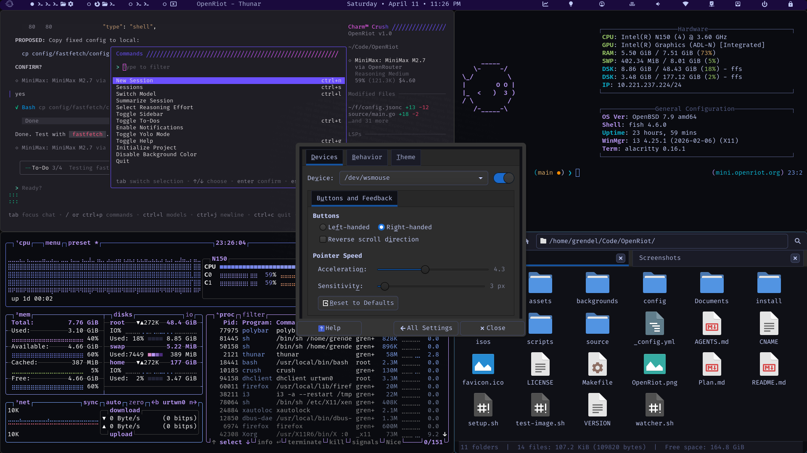
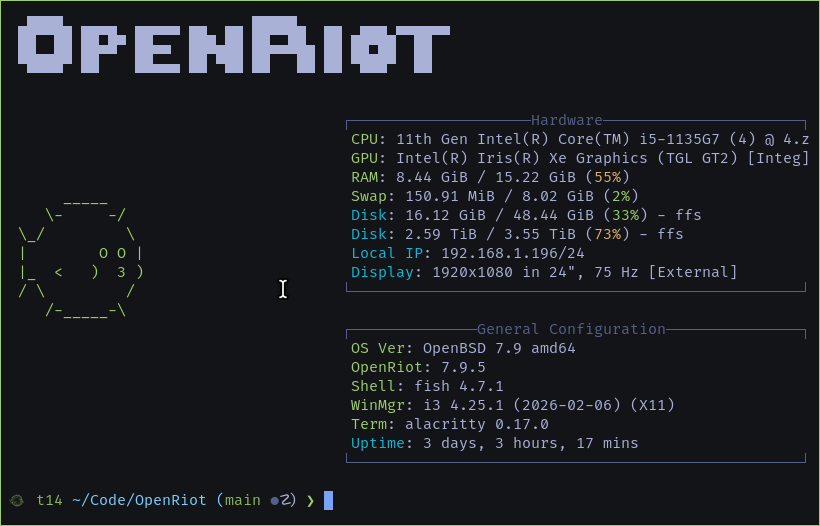
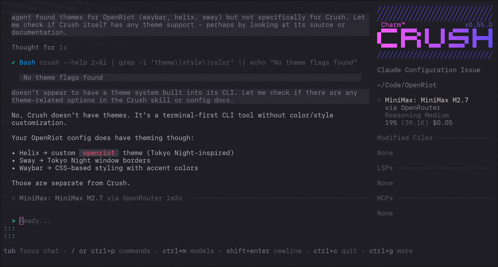

<div align="center">


# :: 𝕆𝕡𝕖𝕟ℝ𝕚𝕠𝕥 ::

## One command. Complete OpenBSD desktop. Zero compromises.


</div>

OpenRiot is the answer to every time you've thought "Why can't an OpenBSD installation just work correctly and be usable without a hundred hours of fiddling?"

- Read the [original Post on X](https://x.com/CyphrRiot/status/2039409143891837297?s=20)

### **Curated to be correct**

- **🪟 i3 Tiling** — X11-native tiling that actually gets it right
- **⚡ Robust Binary** — Atomic operations, run-time, rollbacks, no dependency hell
- **🛡️ Privacy** — Zero telemetry, tracking, data harvesting, or ID requirements
- **🎨 Aesthetics** — Carefully crafted dark themes that work at any hour
- **💻 Development** — Helix, shell enhancements, crush, and other upgrades
- **💎 OpenBSD** — The most security-audited OS on the planet

---



#### Built on OpenBSD.

**Because compromises belong on other operating systems.**

This isn’t shaped by committees, corporate roadmaps, or quarterly deliverables. It’s built and maintained by one person with an obsessive focus on doing it right the first time — because a mediocre computing environment isn’t just inconvenient. It’s an insult to what computers should be.

Built on the same principles as [ArchRiot](https://ArchRiot.org) and by the same creator. If you liked ArchRiot, you'll love OpenRiot.

---

## ⚠️ **The Usual Free Software Warning** ⚠️

OpenRiot is under active development. It may not work as expected. Some features might be broken. Use at your own risk. Blah blah.

**Hardware Diversity:** Every system is unique — different network cards, WiFi chipsets, video cards, storage controllers, and countless other components. We've done our best to handle every possible configuration, but it's simply impossible to be completely comprehensive.

**Found an issue?** [Open an issue on GitHub](https://github.com/CyphrRiot/OpenRiot/issues) and we'll work through it together.

**Repository:** [github.com/CyphrRiot/OpenRiot](https://github.com/CyphrRiot/OpenRiot)

### System Requirements

| Requirement | Notes |
| --- | --- | --- |
| **Resolution** | 1920x1080 minimum | OpenRiot's User Interface requires this |
| **RAM** | 4GB+ minimum | 8GB+ Optimal |
| **Disk** | 25GB+ recommended | 100GB+ Optimal |

> "Linux has never been about quality. There are so many parts of the system that are just these cheap little hacks, and it happens to run." -Theo de Raadt

#### Xenocara's Hardening (OpenBSD's Custom X11 Server)

     "Why it was acceptable to move from Wayland and Sway to a fcking X11 desktop when everyone knows X11 is complete shit."

Xenocara is not vanilla X.Org. It is OpenBSD's integrated, heavily patched build of the X server with these security features:

- **Privilege separation**: The server runs with minimal privileges; input and rendering are isolated.
- **Pledge(2) and unveil(2)**: The X server itself and many clients are sandboxed.
- **No unnecessary setuid root**: Modern Xenocara drops privileges aggressively.
- **Stronger default configuration**: Fewer extensions enabled by default, audited for local attacks.

This makes the underlying X server far more resistant to client-side abuse than stock Xorg on Linux. Xenocara users generally consider it one of the more secure X11 implementations available.

---


## 📚 Navigate This Guide

- [🚀 Installing OpenRiot](#installing-openriot)
- [⌨️ Master Your OpenRiot Desktop](#master-your-openriot-desktop)
- [📝 Using Helix (Editor)](#using-helix)
- [🔄 System Management](#system-management)
- [🧰 Advanced Usage](#advanced-usage)
    - [🔄 Environment Variables](#environment-variables)
    - [⌨️ Keybindings Customization](#keybindings-customization)
    - [📊 Polybar Modules](#polybar-modules)
    - [🌤 Weather Module](#-weather-module-polybar)
    - [🔐 Crypto Config](#-crypto-config)
    - [🔒 WireGuard VPN](#-wireguard-vpn)
    - [📥 Transmission](#-transmission-bittorrent-client)
    - [📂 Proton Drive](#-proton-drive-sync)
- [🔧 Troubleshooting](#troubleshooting)
- [🦊 Browser & Data Transfer](#browser--data-transfer)

## ✅ Supported Systems

### Highly Recommended ThinkPad Series

These ThinkPads have excellent OpenBSD support for WiFi, trackpoints, and suspend/resume:

| Model                 | CPU               | WiFi                         | Notes                                     |
| --------------------- | ----------------- | ---------------------------- | ----------------------------------------- |
| **T14s Gen 1+** (AMD) | Ryzen 3 PRO 4450U | ⭐⭐⭐ `iwm` (AX200 adapter) | Best OpenBSD laptop                       |
| **T490**              | Intel i5-8265U    | ⭐⭐ `iwm` (Intel 9560)      | Good experience overall                   |
| **T480**              | Intel i5-8350U    | ⭐⭐ `iwm` (Intel 8265)      | Works well, slightly older                |
| **X1 Carbon Gen 7**   | Intel i7-8665U    | ⭐⭐ `iwm` (Intel 9560)      | Premium build, good Linux/OpenBSD support |
| **X270**              | Intel i5-6300U    | ⭐ `iwm` (Intel 8265)        | Small, portable, older but solid          |

You can buy a T14s Gen 1 for ~$300 USD at [Amazon](https://www.amazon.com/dp/B086MD6LTM). You can also buy a T14s Gen 1 for around the same price.

### Other Well-Supported Laptops

| Model                   | CPU             | WiFi                    | Notes                                        |
| ----------------------- | --------------- | ----------------------- | -------------------------------------------- |
| **Lenovo V14**          | Ryzen 5 3500U   | ⭐⭐⭐ `iwm` (AX200)    | Budget option, excellent OpenBSD support     |
| **Framework Laptop 13** | Intel i5-1240P  | ⭐⭐⭐ `iwm` (AX211)    | Modular, user-repairable, OpenBSD works well |
| **Dell XPS 13 9300**    | Intel i7-1065G7 | ⭐⭐ `iwm` (Intel 9560) | Beautiful screen, good Linux/OpenBSD support |

### Avoid or Use Caution

| Model             | Reason                                                                   |
| ----------------- | ------------------------------------------------------------------------ |
| **Any MacBook**   | Broadcom WiFi requires proprietary firmware; OpenBSD does not support it |
| **Lenovo Flex 3** | Very new hardware may not be recognized                                  |
| **HP Envy x360**  | Some models have unsupported AMD WiFi                                    |

### Key Components for OpenBSD

- **WiFi**: Use Intel `iwm` or USB Atheros adapters only. See the full supported list below.
- **CPU**: Intel and AMD Ryzen are both well-supported. ARM support is experimental.
- **GPU**: Intel integrated graphics are best-supported. AMD Radeon works but with varying feature support. NVIDIA is not supported on OpenBSD.
- **Trackpoint**: All ThinkPad trackpoints work. Some USB trackpoints may require additional configuration.

## ✅ Supported Network Hardware

#### **⚠️ OpenBSD is very selective about WiFi adapters. Only use adapters from this list:**

### Built-in WiFi (PCIe/M.2)

| Adapter                      | Chip   | OpenBSD Driver | Support Level        | Buy                                                         |
| ---------------------------- | ------ | -------------- | -------------------- | ----------------------------------------------------------- |
| **Intel Wi-Fi 6 AX200**      | `iwm`  | `iwm(4)`       | ⭐⭐⭐ Excellent     | [Check ThinkPad T14s](https://www.amazon.com/dp/B086MD6LTM) |
| **Intel Wi-Fi 6 AX201**      | `iwm`  | `iwm(4)`       | ⭐⭐⭐ Excellent     | Common in 10th-gen+ ThinkPads                               |
| **Intel Wireless 8265**      | `iwm`  | `iwm(4)`       | ⭐⭐ Good            | Found in T470, X270, others                                 |
| **Intel Wireless 8260**      | `iwm`  | `iwm(4)`       | ⭐⭐ Good            | Older but well-supported                                    |
| **Intel Wireless 3165**      | `iwm`  | `iwm(4)`       | ⭐ Good              | Older, 802.11ac only                                        |
| **Intel Wireless 7265**      | `iwm`  | `iwm(4)`       | ⭐⭐ Good            | Found                                                       |
| in T450, X250                |
| **Qualcomm Atheros QCA6174** | `athn` | `athn(4)`      | ⭐⭐ Good            | Found in some ThinkPads                                     |
| **Broadcom BCM4360**         | `brcm` | `brcm(4)`      | ⚠️ Requires firmware | Avoid if possible                                           |

### USB WiFi Adapters (Nano/Compact)

| Adapter                  | Chip      | OpenBSD Driver | Support Level    | Buy                                                 |
| ------------------------ | --------- | -------------- | ---------------- | --------------------------------------------------- |
| **ASUS USB-AC56**        | `urtwn`   | `urtwn(4)`     | ⭐⭐⭐ Excellent | [Check price](https://www.amazon.com/dp/B00PB5VR1G) |
| **TP-Link Archer T3U**   | `urtwn`   | `urtwn(4)`     | ⭐⭐ Good        | Budget option                                       |
| **Netgear A6200**        | `urtwn`   | `urtwn(4)`     | ⭐ Good          | Older but supported                                 |
| **TP-Link TL-WN722N v3** | `urtwn`   | `urtwn(4)`     | ⭐⭐ Good        | Very cheap, 802.11n only                            |
| **Alfa AWUS036NHA**      | `athn`    | `athn(4)`      | ⭐⭐⭐ Excellent | High gain, excellent range, 802.11n                 |
| **Alfa AWUS036ACS**      | `rtl88au` | `rsu(4)`       | ⭐⭐ Good        | Long range, 802.11ac                                |

### NOT Supported (Do Not Buy)

| Adapter                            | Chip        | Reason                                                  |
| ---------------------------------- | ----------- | ------------------------------------------------------- |
| **Any Broadcom** (e.g., BCM94352Z) | `brcmfmac`  | Requires proprietary firmware; OpenBSD will not load it |
| **Realtek 8812AU/8821AU**          | `rtl8812au` | No OpenBSD driver exists                                |
| **MediaTek MT7921**                | `mt7921u`   | No OpenBSD driver                                       |
| **Any 802.11ax (WiFi 6E/7) USB**   | various     | Generally not supported                                 |

## ⚠️ UEFI/BIOS Settings

Before installing OpenBSD (and therefore OpenRiot), you need to make some BIOS/UEFI adjustments to ensure everything works correctly. Most hardware ships with settings that assume you're running Windows or macOS — we need to fix that.

### How to Enter BIOS

- **ThinkPads**: Press `Enter` during boot to interrupt, then `F1` for BIOS. Or press `F12` for boot menu and look for BIOS setup.
- **Other brands**: Press `F2`, `F10`, or `Del` during boot.

### Recommended UEFI/BIOS Settings

1. **Disable Secure Boot** — OpenBSD does not support Secure Boot. You must disable it in BIOS.
    - Navigate to `Security` → `Secure Boot` → Set to **Disabled**
    - If there's a "Microsoft Windows" Secure Boot key, you may need to clear it first

2. **Set Boot Mode to "UEFI Only" (or "UEFI and Legacy" if available)**
    - Navigate to `Boot` → `Boot Mode` → Select **UEFI Only** (or **UEFI + Legacy**)
    - Avoid "Legacy Only" as OpenBSD prefers UEFI

3. **Disable Fast Boot / Fast Startup** (if available)
    - This can prevent the boot menu from appearing

    - Navigate to `Power` → `Fast Startup` → **Disabled**

4. **Enable "USB Boot"** (if available)
    - Ensures you can boot from USB drives

5. **Set boot order to prioritize your USB/ISO device**
    - Navigate to `Boot` → `Boot Order` → Place your USB drive first

6. **Disable Intel VTD** (if you encounter i3/X11 issues)
    - Navigate to `Security` → `Intel VT-d` or `AMD-Vi` → **Disabled**
    - Note: This is only needed in rare cases. Try with it enabled first.

7. **Set SATA mode to AHCI** (not RAID/Intel RST)
    - Navigate to `Storage` → `SATA Mode` → **AHCI**
    - RAID mode can cause OpenBSD to not see the disk

### Pre-Installation Checklist

Before booting the OpenBSD ISO:

- USB drive created with OpenBSD ISO (see above)
- Secure Boot disabled in BIOS
- Boot mode set to UEFI
- USB boot enabled
- SATA mode set to AHCI
- BIOS defaults loaded if you made many changes
- CMOS battery healthy (or laptop plugged in) to preserve settings

### Why This Matters for OpenBSD

OpenBSD is more conservative than Linux about hardware defaults. It assumes a clean, standards-compliant UEFI environment. Secure Boot, fast boot, and RAID modes are all Microsoft/Intel/AMD-specific optimizations that OpenBSD doesn't use — they can cause boot failures, disk recognition issues, or prevent i3 from starting.

## 🔊 Bluetooth

#### **⚠️ OpenBSD has NO native Bluetooth support.** The Bluetooth stack was removed years ago and has not been reinstated.

This means:

- **No Bluetooth audio** (no AirPods, no Bluetooth headphones, no Bluetooth speakers)
- **No Bluetooth mice or keyboards** (pairing will fail)
- **No file transfer** (no OBEX)

### What Doesn't Work

- AirPods, Beats, or any Bluetooth audio device
- Bluetooth mice or keyboards (Logitech MX Master, Apple Magic Mouse, etc.)
- Any device that requires Bluetooth pairing

### Bluetooth Audio Workaround

The best workaround is to use USB audio or a USB Bluetooth adapter that presents itself as a wired audio device. Options:

1. **USB Speaker** — Just plug and play. No Bluetooth needed.
2. **USB DAC + Wired Headphones** — Better audio quality anyway.
3. **AirPods via USB-C cable** — Use them as wired earbuds (yes, really)
4. **USB Bluetooth adapter that works as audio** — Some adapters present A2DP profile as USB audio (very rare)

### Bluetooth Mouse/Keyboard Workaround

1. **Use a USB mouse** — Any basic USB mouse works perfectly
2. **Use a 2.4GHz wireless mouse** — Logitech Unifying Receiver (uses a separate USB dongle, not Bluetooth)
3. **Use a wired mouse or keyboard** — Works 100% of the time

### Recommended Input Setup

For the best OpenBSD + i3 experience:

| Device         | Recommendation                                               |
| -------------- | ------------------------------------------------------------ |
| **Mouse**      | Basic USB mouse (2.4GHz wireless with dongle also works)     |
| **Keyboard**   | Any USB keyboard; ThinkPad keyboards work perfectly          |
| **TrackPoint** | Works natively on ThinkPads — no configuration needed        |
| **Graphics**   | Intel iGPU preferred; AMD Radeon works; NVIDIA not supported |

<a id="choose-your-openriot-experience"></a>

## 🚀 Installing OpenRiot

You will be installing OpenBSD 7.9 and then running a script that installs the full OpenRiot distribution, Window Management, applications, and everything else. It's a process, so be patient with the installation.

> Typical time to install is about 15 minutes.

### 1. Download

OpenBSD 7.9 is available as two download types:

#### Option A: ISO (Best for CD/DVD)

The `.iso` file is intended for optical media. If burning to CD/DVD, use this.

Download: [install79.iso](https://cdn.openbsd.org/pub/OpenBSD/snapshots/amd64/install79.iso)

#### Option B: Disk Image (Best for USB)

The `.img` file is pre-configured for USB boot and bootloader. **Recommended for most users** — use this if installing from USB.

Download: [install79.img](https://cdn.openbsd.org/pub/OpenBSD/snapshots/amd64/install79.img)

### 2. Create bootable USB

> ⚠️ **Choose your file type:**

**For ISO:**
```bash
dd if=install79.iso of=/dev/sdX bs=4M status=progress oflag=sync
```

**For IMG (recommended):**
```bash
dd if=install79.img of=/dev/sdX bs=4M status=progress oflag=sync
```

> ⚠️ Replace `/dev/sdX` with your actual USB device (check with `lsblk` or `dmesg` after inserting).

#### Option C: Ventoy (Best for Testing Multiple ISOs)

Ventoy lets you boot multiple ISOs from one USB drive — no flashing needed, just copy files.

**1. Download Ventoy:**
```bash
# Get Ventoy from https://www.ventoy.org
# Or use the USB installer .img (same method as above)
```

**2. Create Ventoy USB:**
```bash
dd if=ventoy-X.Y.Z.iso of=/dev/sdX bs=4M status=progress oflag=sync
```

**3. Copy OpenBSD ISO:**
```bash
# Just copy the file to the Ventoy partition
cp install79.img /path/to/ventoy-usb/
```

**4. Boot:**
- Select your USB in BIOS boot menu
- Ventoy shows a menu with available ISOs
- Select the OpenBSD/OpenRiot ISO

> Ventoy is especially useful if you plan to test multiple BSD/Linux distributions or reinstall frequently.

### 3. Boot and install OpenBSD

1. Disable Secure Boot, set USB first in boot order
2. At `boot>` prompt, type `I` and press Enter
3. Follow the interactive prompts below:

| Prompt               | Action                                                |
| -------------------- | ----------------------------------------------------- |
| Keyboard layout      | Press `Enter`                                         |
| System hostname      | Type `openriot` → Enter                               |
| Network interface    | Type `done` → Enter                                   |
| IPv4 autoconf        | Press `Enter`                                         |
| IPv6                 | Type `none` → Enter                                   |
| Root password        | Type and confirm password                             |
| Start sshd           | Press `Enter`                                         |
| X Window System      | Type `no` → Enter                                     |
| Setup a user         | Type username → Enter, then set password              |
| Which disk           | Type `sd1` (USB boot: sd0=USB, sd1=target)         |
| Use (W)hole disk MBR | ⚠️ **Choose `G` for GPT** (MBR won't boot)        |
| Encrypt disk         | Type `p` or `no`                                      |
| Partition layout     | Type `c` for custom                                   |
| Label editor         | `z` → `a /` → size → `a swap` → `a /home` → `w` → `q` |
| Location of sets     | **If online:** Type `http` → Use `http` or `httpcd`      |
|                     | **If offline:** Type `disk` → Select the correct disk     |
| Set name(s)          | Press `Enter` (all sets) or type specific sets           |
| SHA256 verification | Type `yes` → Enter                                   |

**Partition layout (choose `c`):**
```
/       50G (or more)
/home   * (rest of disk)
swap    2G (or more)
```

### 4. After install — run setup

When OpenBSD boots for the first time:

1. Log in as your user
2. Type the following commands:
```bash
doas pkg_add curl
curl -fsSL https://openriot.org/setup.sh | sh
```

### 5. Reboot

```bash
reboot
```

After reboot, log in and type `startx` to start the desktop.

---

#### Log Locations

If something goes wrong:

| Stage                | Log File                        |
| -------------------- | ------------------------------- |
| `setup.sh`           | `~/.cache/openriot/setup.log`   |
| `openriot --install`  | `~/.cache/openriot/install.log` |

```bash
cat ~/.cache/openriot/setup.log
cat ~/.cache/openriot/install.log
```

<a id="master-your-openriot-desktop"></a>

## ⌨️ Master Your OpenRiot Desktop

_This section is being actively documented. For now, the essential bindings are documented in [📝 Using Helix](#using-helix). A full OpenRiot keybindings reference is coming._

### Essential Keybindings

| Key                          | Action                           |
| ---------------------------- | -------------------------------- |
| `Super + Return`             | Open terminal                    |
| `Super + Shift + Return`     | Floating terminal                |
| `Super + D`                  | Open app launcher (rofi)         |
| `Super + Q`                  | Close window                     |
| `Super + E`                  | Proton Mail (web app)            |
| `Super + L`                  | Lock screen                      |
| `Super + Z`                  | Toggle floating                  |
| `Super + H`                  | Split horizontal                 |
| `Super + P`                  | Toggle layout                    |
| `Super + Shift + F`          | Toggle fullscreen                |
| `Super + 1-4`               | Switch workspace                 |
| `Super + Shift + 1-4`        | Move window to workspace         |
| `Super + Shift + E`          | Exit i3                          |
| `Super + F`                  | File Manager (Thunar)            |
| `Super + B`                  | Browser (Firefox)                |
| `Super + O`                  | Open Helix (editor)             |
| `Super + C`                  | Open Crush AI                    |
| `Super + T`                  | Open system monitor (btop)      |
| `Super + G`                  | Telegram                         |
| `Super + M`                  | Google Messages                  |
| `Super + X`                  | X (Twitter)                      |
| `Super + K`                  | Google Keep                      |
| `Super + W`                  | Next wallpaper                   |
| `Super + Shift + S`          | Screenshot (region)              |
| `Super + Shift + V`          | Clipboard manager                 |
| `Alt + Tab`                  | Cycle windows                    |
| `Alt + Shift + Tab`          | Cycle windows (reverse)          |
| `Super + Shift + H`          | OpenRiot Help (website)          |
| `Super + Escape`             | Power menu                       |
| `Super + =`                  | Calculator (rofi)                |
| `Super + [ / ]`              | Resize: shrink/grow width       |
| `Super + Shift + [ / ]`      | Resize: shrink/grow height      |
| `Super + -`                  | Show scratchpad                  |
| `Super + Shift + -`          | Move to scratchpad               |
| `Super + Shift + C`          | Reload i3 config                 |
| `Super + Shift + R`          | Restart i3                       |
| `Super + Tab`                | Focus next window                |
| `Super + Shift + Tab`        | Focus previous window             |
| `Super + Arrow keys`         | Focus window direction           |
| `Super + Ctrl + Arrow`       | Move window                      |
| `Super + button4/5`         | Scroll workspaces                |
| `Print`                     | Screenshot (window)              |
| `Shift + Print`             | Screenshot (fullscreen)          |
| `Ctrl + Print`              | Screenshot to clipboard          |
| `Super + Shift + X`         | Compose tweet                    |
| `Super + Shift + space`     | Refresh polybar                  |


### Media Keys

| Key                    | Action                           |
| ---------------------- | -------------------------------- |
| `Volume +/-`           | Adjust volume                    |
| `Mute`                 | Toggle mute                      |
| `Mic Mute`             | Toggle microphone mute           |
| `Brightness +/-`       | Adjust screen brightness         |


### App Launcher (Rofi)

Press `Super + D` to open the app launcher. Only curated apps are shown — no system clutter.

| App              | Icon | Description              |
| ---------------- | ---- | ------------------------ |
| Terminal         | 󰞷   | Alacritty terminal       |
| Firefox          | 󰈹   | Web browser              |
| Telegram         | 󰭹   | Messaging app            |
| Helix            |    | Text editor              |
| Text Editor      |    | GNOME text editor        |
| File Manager     | 󰝰   | Thunar file browser      |
| System Monitor   | 󰍹   | btop resource monitor    |
| Htop             | 󰍹   | Process viewer           |
| Crush AI         | 󰚩   | AI CLI assistant         |
| Media Player     |    | mpv video player         |
| Word Processor   | 󰈙   | Abiword document editor  |
| Settings         | 󰒓   | XFCE settings manager    |
| Transmission     | 󰐻   | BitTorrent client        |
| Proton Mail      | 󰊫   | Email (web app)          |



### Polybar Modules

Polybar is your status bar. Click on modules for more:

| Module          | Click Action                        |
| --------------- | ---------------------------------- |
| Launcher        | Opens app launcher                  |
| Workspaces 1-4  | Click to switch workspace           |
| Window Title    | Shows focused window name           |
| Date            | Click: next wallpaper              |
| night-light     | Toggle night light (redshift)       |
| weather         | Shows current temp + conditions (OpenWeatherMap) |
| crypto          | Shows crypto prices                 |
| CPU             | Shows CPU usage                     |
| memory          | Shows memory usage                  |
| Volume          | Click to toggle mute, scroll adjust |
| Network         | Click for wifi-menu                 |
| wireguard       | Toggle VPN connection               |
| transmission    | Toggle Transmission daemon          |
| Battery         | Click: battery notification        |
| OpenRiot Update | Click to check for updates         |
| Power           | Click for power menu               |
| Lock            | Click to lock screen               |

**Workspace Bar:** Shows all 4 workspaces with indicators and app icons. Example:

```
● 󰞷 󰈹   ○   ◉ 󰝰   ○
```
- `●` focused workspace
- `◉` unfocused with windows
- `○` empty workspace
- Icons show running apps: `󰞷` Alacritty, `󰈹` Firefox, `󰝰` Thunar, etc.

## Shell Aliases & Quick Reference

Fish comes pre-configured with useful aliases:

| Alias | Command   | Description                    |
| ----- | --------- | ------------------------------ |
| `ls`  | `lsd`     | Default listing with icons     |
| `ll`  | `lsd -l`  | Long listing with icons        |
| `la`  | `lsd -la` | Show hidden files              |
| `vi`  | `hx`      | Open Helix editor              |
| `vim` | `hx`      | Open Helix editor              |

### lf File Manager Shortcuts

| Key       | Action                           |
| --------- | -------------------------------- |
| `j/k`     | Navigate down/up                 |
| `h/l`     | Go back / Open file or directory |
| `gh`      | Go to home `~`                   |
| `g/`      | Go to root `/`                   |
| `gg`      | Go to top of listing             |
| `G`       | Go to bottom of listing          |
| `a.`      | Toggle hidden files              |
| `o`       | Open file with default handler   |
| `<enter>` | Open file (same as `o`)          |
| `E`       | Edit file in `$EDITOR` (Helix)   |
| `yy`      | Copy (yank) file path            |
| `yd`      | Copy directory path to clipboard |
| `y.`      | Copy filename to clipboard       |
| `dd`      | Cut / trash file                 |
| `p`       | Paste                            |
| `nf`      | New directory                    |
| `n.`      | New file                         |
| `r`       | Rename (inline edit)             |
| `bc`      | Bulk rename selected files       |
| `za`      | Create archive from selection    |
| `zx`      | Extract archive                  |
| `gs`      | Show git status                  |
| `ai`      | Sort by size                     |
| `at`      | Sort by size + time              |
| `an`      | Sort by name                     |
| `q`       | Quit                             |
| `Q`       | Quit all lf instances            |

**Note:** Press `?` in lf for full help. File previews shown inline (text via bat, images require optional chafa: `doas pkg_add chafa`).

### Tutorial Video

**Tutorial Video:** [How to Set Up and Configure LF (The Best Terminal File Manager)](https://www.youtube.com/watch?v=2oWqD3JCXuI) by Eric Murphy (~16 min)

<a id="using-helix"></a>

## 📝 Using Helix — The Default Editor

OpenRiot ships with **Helix** as the default terminal editor instead of Neovim.

Helix is a modern, fast, and highly polished modal text editor written in Rust. It was chosen for OpenRiot because it perfectly aligns with the project's core philosophy: **simplicity, correctness, excellent defaults, and minimal maintenance overhead**.

### Why Helix Was Chosen Over Neovim

- **Sane defaults out of the box** — Built-in LSP support, Tree-sitter syntax highlighting, multi-cursor editing, fuzzy finding, and diagnostics work immediately with zero configuration.
- **Minimal configuration** — A single, readable `config.toml` file (usually under 100 lines) replaces hundreds of lines of Lua plugins and init scripts.
- **Performance** — Extremely fast startup time and low memory usage, which feels especially good on OpenBSD.
- **Simpler maintenance** — Much easier to include and keep consistent across OpenRiot installs and future OpenBSD releases.
- **Modern editing model** — Selection-first workflow (select then act) is consistent and reduces cognitive load once learned.
- **Better security & auditability** — Written in Rust with memory safety, aligning with OpenBSD's values.

Helix gives you a powerful, modern editing experience while staying lightweight and "correct" — exactly what OpenRiot aims for.

### Getting Started with Helix

Launch Helix with:

- `Super + O` — Open Helix (default keybinding in OpenRiot)
- Or simply run `hx` in any terminal

Helix starts in **Normal mode** by default. Here are the most important commands to get you productive quickly:

#### Basic Movement & Modes

| Key         | Action                                |
| ----------- | ------------------------------------- |
| `i`         | Enter **Insert mode** (type normally) |
| `Escape`    | Return to **Normal mode**             |
| `h j k l`   | Move left / down / up / right         |
| `w / b / e` | Jump word forward / backward / to end |
| `gg / G`    | Go to top / bottom of file            |
| `0 / $`     | Go to start / end of line             |

#### Editing

| Key     | Action                              |
| ------- | ----------------------------------- |
| `x`     | Select current line                 |
| `y`     | Yank (copy) selection               |
| `p / P` | Paste after / before cursor         |
| `d`     | Delete selection                    |
| `c`     | Change (delete + enter Insert mode) |
| `> / <` | Indent / unindent selection         |
| `u / U` | Undo / Redo                         |

#### Advanced & Useful

| Key            | Action                                     |
| -------------- | ------------------------------------------ |
| `Space + f`    | Open file picker (fuzzy finder)            |
| `Space + b`    | Switch between open buffers                |
| `Space + s`    | Symbol picker (functions, variables, etc.) |
| `/`            | Search forward                             |
| `:`            | Command mode (`:w`, `:q`, `:wq`, etc.)     |
| `gd`           | Go to definition (via LSP)                 |
| `Ctrl+w v / s` | Split window vertically / horizontally     |

### Vim to Helix Quick Reference

If you know Vim/Neovim, here's how the same tasks work in Helix:

| Task                       | Vim/Neovim                 | Helix Equivalent            | Notes / Nuances in Helix                                                                                                                                   |
| -------------------------- | -------------------------- | --------------------------- | ---------------------------------------------------------------------------------------------------------------------------------------------------------- |
| Go to top of document      | `gg`                       | `gg`                        | Same as Vim. Also works with a count (e.g., `5gg` for line 5).                                                                                             |
| Go to bottom of document   | `G`                        | `G`                        | `G` goes to bottom of document (OpenRiot remaps this).                                                                             |
| Delete character           | `x`                        | `x`                        | Selects entire line in Helix. Use `dl` to delete line, or `d` after selection.                                                      |
| Delete line                | `dd`                       | `dl`                       | Use `dl` (delete line under cursor).                                                                                               |
| Go to end of line          | `$`                        | `gl`                        | `gl` = goto line end. Very common.                                                                                                                         |
| Go to start of line        | `0` or `^`                 | `gh`                        | `gh` = goto home (start of line). Use `gs` if you want the first non-whitespace character (like Vim's `^`).                                                |
| Copy line (yank line)      | `yy`                       | `yl`                        | `yl` yanks the current line.                                                                                                                               |
| Paste line                 | `p` (below) or `P` (above) | `p` (after) or `P` (before) | Works similarly, but Helix pastes after/before the current selection (or cursor position). For a full line paste, the behavior is usually what you expect. |
| Copy text (yank selection) | `y` (after selecting)      | `y`                         | Same letter, but you select first (e.g., `w` for word, `gl` for to end of line, or visual movements).                                                      |
| Paste text                 | `p` or `P`                 | `p` or `P`                  | Same as above. Helix also supports system clipboard via `<space>p` / `<space>y` (or configure defaults).                                                   |

### Helix on OpenBSD & OpenRiot

Helix works **beautifully** on OpenBSD:

- Excellent performance on ThinkPads and Framework laptops
- Native OpenBSD packaging (`pkg_add helix`)
- Full Tree-sitter and LSP support for Go, Rust, Python, Lua, YAML, TOML, and many other languages
- No plugin manager headaches — everything just works
- Plays perfectly with i3, Alacritty terminal, and fish shell

**Pro tip:** Helix has one of the best default dark themes available. It looks right at home with OpenRiot's dark aesthetic.

For the complete keymap and configuration options, visit the official documentation:  
[https://docs.helix-editor.com/](https://docs.helix-editor.com/)

_See the [helix-cheat-sheet](https://github.com/stevenhoy/helix-cheat-sheet) project for a visual keybinding reference._

**Tutorial Video:** [Helix Editor Crash Course](https://www.youtube.com/watch?v=HcuDmSb-JBU)

### AI Integration with OpenRouter

OpenRiot bundles **Crush** for AI-assisted coding. Crush is a modern, lightweight, Go-based terminal AI coding agent with excellent OpenBSD support. It is built automatically during setup and installed to `/usr/local/bin/crush`.



#### Configure Crush

Create `~/.config/crush/config.yaml`:

```yaml
provider: openrouter
model: minimax/minimax-m2.7
api_key: sk-or-XXXXXXXXXXXXXXXXXXXXXXXXXXXXXXXX
```

Replace `sk-or-XXXXXXXX...` with your actual OpenRouter API key from https://openrouter.ai/settings

#### How to Use

Run Crush in a terminal:

```fish
crush
```

For a Zed-like experience, run Helix and Crush side-by-side in Zellij:

1. Start Zellij with a vertical split
2. Left pane: `hx`
3. Right pane: `crush`

Select code in Helix (`y` to yank), paste into Crush, and ask questions.

### Password Management with Glyphriot

OpenRiot includes **[Glyphriot](https://github.com/CyphrRiot/glyphriot)**, a secure password manager that uses a memorable seed phrase and optional glyph to derive your master password. Run with:

```fish
glyphriot --prompt
```

This prompts for your seed and optional glyph, then derives the master password using Argon2id.

**Key features:**
- Seed + glyph → master password (never stored)
- Supports multiple services
- Encrypted storage with age
- Master password derived on-demand

**Security notes:**
- Your seed is never stored — only the derived hash
- Use a strong, unique seed you can remember
- Add a glyph for extra security (optional but recommended)

<a id="browser--data-transfer"></a>

## 🦊 Browser & Data Transfer

#### **OpenBSD has no Brave browser.** Chromium-based browsers are limited — only Ungoogled Chromium is available, and Firefox is the recommended default.

This means:

- **No Brave, no Chrome, no Edge** — these Chromium derivatives are not ported
- **Firefox is the recommended browser** — available as `firefox` package
- **Ungoogled Chromium** — available as `ungoogled-chromium` for those who prefer Chromium

### Why Firefox?

| Browser                | OpenBSD Support  | Notes                         |
| ---------------------- | ---------------- | ----------------------------- |
| **Firefox**            | ✅ Full          | `pkg_add firefox`             |
| **Ungoogled Chromium** | ✅ Available     | `pkg_add ungoogled-chromium`  |
| **Brave/Chrome/Edge**  | ❌ Not available | Chromium derivatives, no port |

Firefox is open source, actively maintained, privacy-respecting by default, and has excellent OpenBSD support.

---

### Transferring Your Data from Brave

If you're moving from Arch/Brave to OpenBSD/Firefox, here's how to migrate your data.

#### Bookmarks (Easy ✅)

Brave and Firefox both support standard HTML bookmark export/import:

```bash
# 1. In Brave
Navigate to brave://bookmarks/ → click ⋮ → Export Bookmarks

# 2. In Firefox
Bookmarks → Show All Bookmarks → Import and Backup → Import → Choose HTML file
```

#### Extensions

Unfortunately, extensions must be **manually reinstalled** in Firefox. There is no bulk export when moving to a different system.

```bash
# Visit Firefox Add-ons and reinstall each one:
about:addons
```

#### Passwords (Moderate 🔧)

**Option 1: CSV Export (Quick)**

```bash
# In Brave
brave://settings/passwords → Export Passwords → CSV

# In Firefox
about:logins → Import → CSV
```

> ⚠️ CSV is unencrypted — only do this on a trusted machine.

**Option 2: Just re-login** — skip the export entirely for security.

#### History (Difficult ⚠️)

Firefox and Chromium use incompatible SQLite schemas. Full history transfer requires third-party tools:

```bash
# Export Brave history to JSON
pip install browser-history
browser-history --browser brave -f json > brave_history.json

# Import to Firefox (limited tool support)
```

For most users, **accepting the loss of browsing history** and starting fresh is the pragmatic choice.

---

### Recommended Workflow

1. **Export bookmarks** from Brave → import to Firefox
2. **Transfer passwords** using CSV or just re-login as needed
3. **Accept** that history won't transfer cleanly

<a id="system-management"></a>

## 🔄 System Management

OpenRiot uses `pkg_add` for package management. Packages are pre-configured in `/etc/installurl` to use OpenBSD's official CDN.

### Finding Packages

```bash
# Search for a package
pkg_info -Q <package-name>

# List all installed packages
pkg_info -m

# Check for updates (OpenBSD doesn't have a rolling update model)
# Fresh install is always the current release
```

### Updating the System

OpenBSD doesn't use `apt update` or `pacman -Syu`. To update:

1. Download and boot the **new** OpenBSD ISO
2. Run `Upgrade` instead of `Install`
3. Your `/home` partition is preserved
4. All packages are refreshed from the new ISO

For packages between releases:

```bash
# Install a new package
pkg_add <package-name>

# Remove a package
pkg_delete <package-name>
```

### Updating OpenRiot

OpenRiot upgrades are handled automatically. When a new version is released, Polybar will notify you. Click the update indicator to upgrade.

#### How Upgrades Work

| Scenario              | What Happens                                                       |
| --------------------- | ------------------------------------------------------------------ |
| **Fresh install**     | Clones repo, installs packages, builds source, deploys configs     |
| **Version available** | Pulls latest from git, re-runs package install, re-deploys configs |
| **Same version**      | Re-deploys configs only (preserves existing settings)              |

#### Upgrade Paths

**Automatic (Polybar):**

1. Polybar shows update indicator when new version available
2. Click the indicator → confirmation dialog
3. Confirm → upgrade runs in terminal

**Manual:**

```bash
# Same command works for fresh install and upgrade
curl -fsSL https://openriot.org/setup.sh | sh
```

The script automatically detects:

- No existing install → fresh install
- Older version → upgrade (git pull + re-run)
- Same version → config refresh only

All package installation uses `pkg_add -D unsigned` — fresh packages matching the current OpenBSD release are always fetched from the CDN.

<a id="advanced-usage"></a>

## 🧰 Advanced Usage

### Environment Variables

OpenRiot sets sensible defaults. Key environment variables:

```bash
# Check OpenRiot version
openriot --version

# XDG directories (usually correct by default)
echo $XDG_CONFIG_HOME
echo $XDG_DATA_HOME

# Fish is the default shell
echo $SHELL  # Should show /usr/local/bin/fish
```

### Keybindings Customization

Keybindings are in `~/.config/i3/keybindings.conf`.

Edit this file to customize. After saving, press `Super + Shift + R` to reload i3.

### Polybar Modules

Polybar modules are in `~/.config/polybar/config`.

Each module is a custom script that outputs icon + info for display. Modules update automatically and respond to clicks.

| Module | Icons | Click Action | Scroll |
|--------|-------|-------------|--------|
| **launcher** |  | Open app launcher (Rofi) | - |
| **workspaces** | 1-4 | Switch to workspace | - |
| **window-title** | text | - | - |
| **date** | text | Next wallpaper | - |
| **volume** |  muted, 󰕿 low, 󰖀 med, 󰕾 high | Toggle mute | Volume adjust |
| **network** | 󰤯 disconnected, signal bars | WiFi info | - |
| **battery** | 󰂄 charging, 󰂂-󰁺 discharge levels | - | - |
| **crypto** |  | Show crypto prices | - |
| **night-light** | /󰌵 | Toggle redshift | - |
| **cpu** | 󰡳/󰡵/󰊚/󰡴 (0-25/50/90%+) | CPU notification | - |
| **memory** | 󱊔/󱊗/󱊖/󱊕 (0-25/50/90%+) | Memory notification | - |
| **wireguard** | 󰛳/󰅛/󰱓 | Toggle VPN | - |
| **openriot-update** | 󰋻 update, 󰚇 up to date | Check for updates | - |
| **weather** | Based on condition code | - | - |
| **proton-drive** | 󰴋 | Sync Proton Drive | - |
| **transmission** | 󰐻 active, 󱧝 stopped | Toggle daemon | - |
| **power** | ⏻ | Open power menu | - |
| **lock** | 󰌾 | Lock screen | - |

### 🌤 Weather Module (Polybar)

The weather module shows current temperature and conditions in the polybar status bar using OpenWeatherMap API.

**Configuration:**

1. Create weather config at `~/.config/weather.cfg`:

```ini
location=Las Vegas
units=imperial
api=85a4e3c55b73909f42c6a23ec35b7147
```

- `location` - City name (required)
- `units` - `imperial` (°F) or `metric` (°C)
- `api` - OpenWeatherMap API key (optional, uses built-in key if omitted)

2. Restart polybar: `Super + Shift + R`

**If no config exists**, the weather module is hidden automatically.

**Weather Icons:**

| Code | Condition | Icon |
|------|-----------|------|
| 01x | Clear sky | 󰖕 |
| 02x | Few clouds |  |
| 03x/04x | Scattered/broken |  |
| 09x | Drizzle |  |
| 10x | Rain |  |
| 11x | Thunderstorm |  |
| 13x | Snow |  |
| 50x | Mist/Fog | 󰖑 |
| default | Unknown | 󰨹 |

---

### 🔐 Crypto Config

**Crypto on Lock Screen**

- Config file: `~/.config/crypto.toml` (copied on first install)
- Shows prices and optional P/L on i3lock background

#### Configuration

```toml
# ~/.config/crypto.toml
api_key = ""

[indicators]
rsi_period = 14
oversold = 30
overbought = 70
bb_period = 16
bb_std = 2.0

# Set held=0 to show price only
pairs = [
    { sym = "XMR", coin = "monero",    held = 0, entry = 0 },
    { sym = "ZEC", coin = "zcash",     held = 0, entry = 0 },
    { sym = "BTC", coin = "bitcoin",    held = 0, entry = 0 },
]

[display]
show_totals = false
max_pairs = 6
```

**Quick rules:**

- Add coin: `{ sym = "SYM", coin = "coin-gecko-id", held = 0, entry = 0 }`
- Show P/L: set `held > 0` AND `entry > 0`
- Show totals: `show_totals = true`

### 🔒 WireGuard VPN

OpenRiot includes a polybar module to toggle WireGuard VPN with a single click.

#### Prerequisites

1. Install WireGuard tools:
```bash
pkg_add wireguard-tools
```

2. Create the config directory:
```bash
doas mkdir -p /etc/wireguard
```

#### Setting Up Mullvad VPN

1. **Generate your config:**
   - Go to [mullvad.net/en/account/wireguard-config](https://mullvad.net/en/account/wireguard-config)
   - Select **Linux** platform (WireGuard works the same on OpenBSD)
   - Click **Generate Key**
   - Choose a server location (Country/City)
   - Download the config file

2. **Install the config:**
```bash
# Move the downloaded config to WireGuard directory
doas mv ~/Downloads/mullvad.conf /etc/wireguard/wg0.conf
```

#### Using the VPN

**Polybar Module:**

| Icon | Meaning |
---------------|
| 󰛳 | No config file installed |
| 󰅛 | Config exists, VPN disconnected |
| 󰱓 | VPN connected |

Click the icon to toggle. You'll see notifications for:
- "Starting WireGuard..."
- "Stopping WireGuard..."
- "WireGuard is not configured. Go to OpenRiot.org Read directions." (if no config)

#### Manual Commands

```bash
# Connect
doas wg-quick up /etc/wireguard/wg0.conf

# Disconnect
doas wg-quick down /etc/wireguard/wg0.conf

# Verify connection
curl https://am.i.mullvad.net/json
```

The output should show `"mullvad_exit_ip": true` when connected.

#### Auto-start at Boot (Optional)

Create `/etc/rc.local`:
```bash
#!/bin/sh
wg-quick up /etc/wireguard/wg0.conf
```

Make it executable:
```bash
doas chmod +x /etc/rc.local
```

#### Troubleshooting

**VPN won't connect:**
```bash
# Check if config exists
ls -la /etc/wireguard/wg0.conf

# Check interface
ifconfig wg0
```

**Slow speeds:**
- Try a different Mullvad server location
- Some Mullvad servers may have limited bandwidth

## 📥 Transmission BitTorrent Client

OpenRiot includes Transmission daemon with a web interface and polybar integration.

### ⚠️ IMPORTANT: Use with VPN

**Always run Transmission behind a VPN!** Your ISP can see BitTorrent traffic, and you can receive copyright infringement notices (or worse) if you download copyrighted material. 😉

Click the **VPN icon** 󰱓 in polybar to connect before downloading anything.

### Accessing the Web Interface

Open in Firefox: [http://127.0.0.1:9091](http://127.0.0.1:9091)

No authentication required by default.

### Polybar Module

| Icon | Meaning |
---------------|
| 󰅤 | Transmission stopped |
| 󰭽 | Transmission running |

Click the icon to toggle. Notifications confirm state changes.

### Rofi Menu

The app launcher (Rofi) also has a Transmission entry that dynamically shows:
- **Transmission** 󰐻 — Click to stop (running)
- **Transmission** 󱧝 — Click to start (stopped)

### Default Settings

- **Download directory:** `~/Downloads`
- **Blocklist:** Enabled (courtesy of [BT BlockLists](https://github.com/Naunter/BT_BlockLists))
- **RPC port:** 9091
- **Peer port:** 51413 (randomized)

### Manual Commands

```bash
# Check if running
pgrep transmission-daemon

# View logs
cat ~/.local/share/transmission/daemon.log
```

## 📂 Proton Drive Sync

OpenBSD has no native Proton Drive client. OpenRiot includes **rclone** for end-to-end encrypted bidirectional file syncing.

### Complete Setup Guide

### 1. Create Proton Drive Folder

1. Log into [drive.proton.me](https://drive.proton.me)
2. Create a new folder named **`ProtonSync`** (case-sensitive)

### 2. Configure rclone

```bash
rclone config
```

| Prompt | Action |
----------------|
| `n` | New remote |
| Name | `ProtonSync` |
| Storage | `protondrive` |
| Proton email | Your email |
| Proton password | Your password |
| 2FA | Code if enabled |

### 3. Create Local Sync Folder

```bash
mkdir -p ~/ProtonSync
```

### 4. Initial Sync (dry-run first)

```bash
rclone bisync ~/ProtonSync proton:ProtonSync --dry-run
```

If output looks correct, remove `--dry-run` to sync.

### 5. Set Up Automatic Sync

Edit your crontab:
```bash
doas crontab -e
```

Add this line (replace `username` with your actual username):
```cron
*/15 * * * * /usr/local/bin/rclone bisync /home/username/ProtonSync proton:ProtonSync --fast-list >> /var/log/rclone.log 2>&1
```

### 6. Secure Your Config

```bash
chmod 600 ~/.config/rclone/rclone.conf
```

### How It Works

- **Polybar icon** 󱥾 synced, 󰴋 needs sync, 󰫢 not configured
- **Click the icon** to sync (auto-init cache on first click)
- Files are encrypted client-side before transit (end-to-end encryption)

### Sync Between Multiple Systems

`rclone bisync` is bidirectional — it syncs both ways:
- Local changes → Proton Drive
- Proton Drive changes (from other systems) → Local

If both systems edit the same file, rclone creates a conflict file (`.sync_orig`) that you can manually resolve.

### Security Notes

- Your files remain encrypted end-to-end — Proton never sees unencrypted data
- rclone never sees your actual file contents
- Keep `rclone.conf` permissions at 600
- Run rclone as your normal user, never root

## 📨 Signal with Gurk

A pure-Rust Signal messenger TUI — zero Java, zero GTK/libsecret. Built for OpenBSD.

### First Run

1. Launch from the app launcher (SUPER+D) or run `~/.local/bin/gurk`
2. On first launch it will prompt for a passphrase — **select "Store it in config"**, not "prompt" (prompt mode causes issues)
3. Open Signal on your phone → Linked Devices → add a new linked device → scan the QR code
4. Wait 2–3 minutes, then press `ctrl+p` to open the channel list

**Note:** Gurk does not remember channels or messages on startup — it starts clean and only updates when you receive messages. If the channel list stays empty, press `ctrl+p` to force the popup, wait 30–60 seconds, or send yourself a test message from your phone.

### Daily Workflow

| What | How |
|------|-----|
| Open channel popup | `ctrl+p` (most important key) |
| Switch channels | `ctrl+j` / `ctrl+k` or Up/Down |
| Read messages | Scroll with `alt+Up` / `alt+Down` or `PgUp` / `PgDn` |
| Select a message | `PgUp` / `PgDn` |
| Reply | Type your message + `Enter` |
| Open a link | `Enter` with empty input |
| View attachment | `Enter` on selected message |
| Multi-line input | `alt+Enter` |
| Send a file | `alt+Enter` then `file:///home/{user}/{path}` |
| Attach clipboard image | `alt+Enter` then `file://clip` |
| React to a message | Select it → type emoji → `tab` |
| Copy message | `alt+y` |
| Open help | `f1` |
| Deselect message | `ESC` |
| Mouse support | Click Edit field or Channel (not messages) |

### Emoji

Use GitHub-style shortcodes (`:` + name + `:`) or type the emoji directly:

```
:thumbsup:  :heart:  :+1:  :rocket:  :fire:  :skull:  :tada:  :clap:  :muscle:  :100:
```

Or just paste Unicode emoji with `ctrl+Shift+V`.

### Build / Update

```bash
cd ~/Code/OpenRiot && ./scripts/gurk.sh
```

The script applies the OpenBSD SIGSEGV fix patch (notify-rust calls `/proc/self/exe` which doesn't exist on OpenBSD), caches the source at `~/src/gurk-rs`, and installs to `~/.local/bin/gurk`.

### Reset and Re-link

```bash
rm -rf ~/.config/gurk ~/.local/share/gurk ~/.cache/gurk
~/.local/bin/gurk --relink
```

Then scan the QR code again from your phone.

## 🔧 Troubleshooting

### Upload Logs for Support

If something goes wrong, upload your log file for debugging:

```bash
# Setup log location
~/.cache/openriot/setup.log

# Install log location
~/.cache/openriot/install.log

# Share install log
~/.local/share/openriot/install/openriot --share-log install.log
```

This will upload the log to tmpfiles.org and give you a URL to share.

### Hostname shows as `x.my.domain`

If the hostname prompt was left blank during install, OpenBSD sets a default domain of `my.domain`, making your hostname look like `openriot.my.domain`.

**Fix:**
```bash
doas vi /etc/myname
# Change: openriot.my.domain
# To:     openriot
# Then reboot.
```

### WiFi not working

1. **Check if WiFi is recognized:**

    ```bash
    ifconfig | grep -E "^iwm[0-9]"
    ```

2. **If no WiFi device shows:**
    - Your adapter may not be supported (see hardware list above)
    - Try a USB WiFi adapter from the supported list
    - Check `dmesg` for hardware errors

3. **Connect to WiFi:**

    OpenRiot uses **ifconfig** for WiFi management on OpenBSD.

    Click the **network icon in Polybar** or run `ifconfig iwn0 up` + `fw_update` to set up WiFi.

    ```bash
    # Connect manually via hostname.if(5):
    doas vi /etc/hostname.iwn0
    # Add: nwid "YourNetworkName" wpakey "YourPassword" dhcp
    # Add: inet autoconf
    # Add: mode 11g
    # Then: doas sh /etc/netstart iwn0
    ```

4. **After connecting:**
    ```bash
    # Verify connection
    ifconfig iwn0
    ping -c 3 cdn.openbsd.org
    ```

### i3 won't start

1. **Check for errors:**

    ```bash
    i3 2>&1 | head -50
    ```

2. **Common fixes:**
    - Graphics driver issue: Check X11 logs at `/var/log/Xorg.0.log`
    - Verify DISPLAY is set: `echo $DISPLAY`

3. **Check dmesg for hardware issues:**
    ```bash
    dmesg | grep -E "error|failed|intel|amd|nvidia"
    ```

### Package missing

If `pkg_add` fails:

1. **Verify installurl is set:**

    ```bash
    cat /etc/installurl
    # Should show: https://cdn.openbsd.org/pub/OpenBSD
    ```

2. **Set it if missing:**

    ```bash
    echo "https://cdn.openbsd.org/pub/OpenBSD" | doas tee /etc/installurl
    ```

3. **Try again:**
    ```bash
    pkg_add -v <package-name>
    ```

> "You are absolutely deluded, if not stupid, if you think that a worldwide collection of software engineers who can't write operating systems or applications without security holes, can then turn around and suddenly write virtualization layers without security holes." — Theo de Raadt
